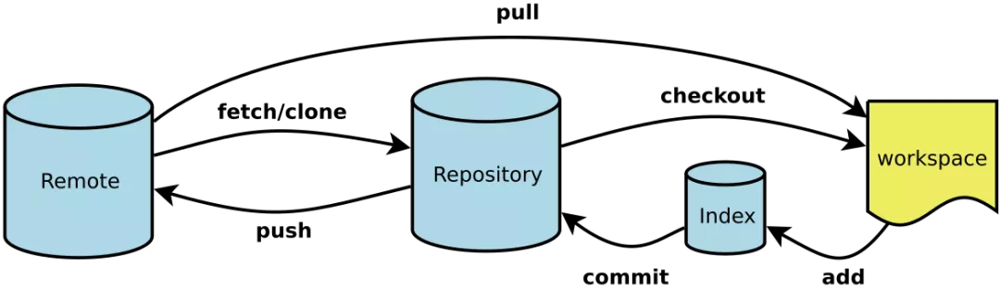

# Git 使用教程

## Git 工作流程



## 常见概念

* Workspace：工作区（就是我们本地的存放代码的目录）
* Index / Stage：暂存区（我们 git add 后，修改的内容会先存放到暂存区 .git/index）
* Repository：仓库区（或本地仓库）（也就是我们项目目录下的 .git 文件夹，这个文件不属于工作区，它是本地版本仓库。）
* Remote：远程仓库

## 开发工作流程

```bash
# 要开发一个新的登录注册功能模块，先新建一个本地分支
git checkout -b login-register

# 每次开发前先更新主分支代码到本地(login-register)分支
git pull origin master

# 开发代码...

# 本地测试...

# 登录注册功能完成后，合并本地分支(login-register)到主分支
# 切换到主分支
git checkout master

# 合并分支
git merge login-register

# 本地主分支下测试...

# 提交代码到远程仓库
git push origin master

# 登录生产服务器，更新并同步代码
git pull

# 同步代码到其他 web 服务器
/opt/api-inotify-rsync.sh 同步后端接口代码

# 前端代码需要先编译后同步
/opt/m-inotify-rsync.sh 同步后台前端页面代码
/opt/h5-inotify-rsync.sh 同步H5、小程序代码
```

## 常用命令

```bash
# 创建并进入 test 目录
mkdir test
cd test

# 创建 git 仓库
git init

# 添加并编辑测试文件
touch readme.md

# 添加 111111 内容到 readme 文件
# git status 查看状态
# git add -A 添加所有修改文件到暂存区
# 添加 readme 文件到暂存区
git add readme.md

# 提交暂存区到本地仓库
git commit -m"添加 111111 到 readme 文件"

# 重复上面的步骤，添加 222222 到 readme 文件
# 查看提交记录
git log 
# git log -p 查看提交记录并展示修改内容
# git log --author=username 查看指定用户的提交记录
# git log --pretty=oneline 精简显示提交记录

# git commit 之前如何撤销？
# 撤销暂存区
git reset HEAD filename

# git commit 之后如何撤销？
# 版本回退
# 回退到上一个版本
git reset --hard HEAD^
# 回退到上上一个版本
git reset --hard HEAD^^
# 回退到前100个版本
git reset --hard HEAD~100

# 查看回退之前的版本号
git reflog
# 撤销版本回退
git reset --hard 版本号

# 撤销修改（没有 add 之前）
git checkout -- filename

# 保存工作区修改内容
git stash

# 查看已隐藏工作区内容
git stash list

# 恢復工作区
git stash apply 

# 删除已隐藏的工作区内容
git stash drop

# 恢復已隐藏工作区同时删除已隐藏工作区
git stash pop

# 创建并切换分支
git checkout -b branch-name

# 创建分支
git branch branch-name

# 切换分支
git checkout branch-name

# 查看分支
git branch

# 查看所有分支（包括远程分支）
git branch -a

# 删除分支
git branch -d branch-name

# 合并分支
git merge branch-name

# 拉取远程仓库代码并自动合并
git pull 

# 拉取远程仓库的代码但是不自动合并
git fetch

# 对比本地代码与新拉取的远程分支的代码
git diff FETCH_HEAD

# 合并新拉取的远程分支的代码
git merge FETCH_HEAD
```

## 参考文章
* [https://mp.weixin.qq.com/s/D8Ds_CDdWtSE_k8Av49qng](https://mp.weixin.qq.com/s/D8Ds_CDdWtSE_k8Av49qng)