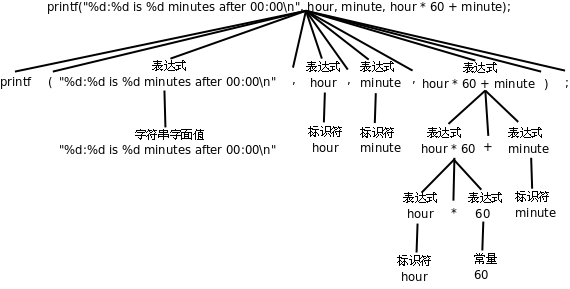

# Linux C编程一站式学习 —— C语言入门（Top Down）

## 第一章 程序的基本概念

### 1. 程序和编程语言

程序（Program）告诉计算机应如何完成一个计算任务，这里的计算可以是数学计算，比如：解方程，也可以是符号运算，比如：查找和替换文档中的某个单词。从根本上说，计算机是由数字电路组成的运算机器，只能对数字做运算，程序之所以能做符号运算，是因为符号在计算机内部也是用数字表示的。

程序由一系列指令（Instruction）组成，指令是指示计算机做某种运算的命令，通常包括以下几类：
* 输入（Input）
* 运算
* 输出（Output）
* 测试和分支
* 循环

任何一个程序，不管它有多么复杂，都是由这几类指令组成的。

编程语言（Programing Language）分为低级语言（low-level language）和高级语言（high-level language）。机器语言（machine language）和汇编语言（assembly language）属于低级语言，直接用于计算机指令编写程序。而C、C++、Java、Python等属于高级语言，用语句（statement）编写程序，语句是计算指令的抽象表示。

### 2. 自然语言和形式语言
自然语言（natural language）就是人类讲的语言，比如汉语、英语和法语等。
形式语言（formal language）是为了特定应用而认为设计的语言。例如数学家用的数字和运算符号、化学家用的分子式等。

形式语言有严格的语法（syntax）规则，例如，3+3=6是一个正确的数学等式，而3=+6$则不是。语法规则由符号（token）和结构（structure）的规则所组成的。token的概念相当于自然语言中的单词和标点、数学式中的数和运算符、化学分子式中的元素名和数字，例如3=+6$的问题之一在于$不是一个合法的数也不是一个事先定义好的运算符。结构是指token的排列方式，3=+6$还有一个结构上的错误，虽然加号和等号都是合法的运算符，但是不能在等号之后紧跟加号。关于token的规则称为词法（lexical）规则，而关于结构的规则称为语法（grammar）规则。

当阅读一个自然语言的句子或者一种形式语言的语句时，你不仅要搞清楚每个词（token）是什么意思，而且必须搞清楚整个句子的结构是什么样的。这个分析句子结构的过程称为解析（parse）。例如，当你听到"The other shoe fell."这个句子时，你理解the other shoe是主语，而fell是谓语动词，一旦解析完成，你就搞懂了句子的意思，如果知道shoe是什么东西，fell意味着什么，这句话是在什么上下文（context）中说的，你还能理解这个句子主要暗示的内容，这些都属于语义（semantic）的范畴。

现在给出一些关于阅读程序（包括其他形式语言）的建议。首先请记住形式语言远比自然语言紧凑，所以要多花点时间来读。其次，结构很重要，从上到下从左到右读往往不是一个好办法，而应该学会在大脑里解析：识别token，分解结构。最后，请基础细节的影响，诸如拼写错误和标点错误这些在自然语言中可以忽略的小毛病会把形式语言搞得面目全非。

### 3. 程序的调试
编译时错误
运行时错误（run-time）
逻辑错误和语义错误

### 4. 第一个程序
``` c
#include <stdio.h>

/* main: generate some simple output */
int main(void)
{
    printf("Hello, World.\n");
    return 0;
}
```

## 第二章 常量、变量和表达式

### 1. 继续Hello World
C语言的历史大致分为三个阶段：Old Style C、C89和C99。

C标准规定的转义字符：

转义字符      |含义
-------------|---------------
\\'          |单引号'（Single Quote或Apostrophe）
\\"          |双引号"
\\?          |问号?（question mark）
\\           |反斜线\（backslash）
\a           |响铃（alert或bell）
\b           |退格（backspace）
\f           |分页符（form feed）
\n           |换行（line feed）
\r           |回车（carriage return）
\t           |水平制表符（horizontal tab）
\v           |垂直制表符（vertical tab）

### 2. 常量
常量（constant）是程序中最基本的元素，有字符（character）常量、整数（integer）常量、浮点数（floating point）常量和枚举常量。

例：printf("character: %c\ninteger: %d\nfloating point: %f\n", '}', 34, 3.14);
printf中第一个字符串称为格式化字符串（format string），它规定了后面几个常量以何种格式插入到这个字符串中，在格式化字符串中%号（percent sign）后面加上字母c、d、f分别表示字符型、整型和浮点型的转换说明（conversion specification），转换说明只在格式化字符串中占个位置，并不出现在最终的打印结果中，这种用法通常叫做占位符（placeholder）。这也是一种字面意思与真实意思不同的情况，但是转换说明和转义序列又有区别：转义序列是编译时处理的，而转换说明是在运行时调用printf函数处理的。源文件中的字符串字面值是"character: %c\ninteger: %d\nfloating point: %f\n"，\n占两个字符，而编译之后保存在可执行文件中的字符串是character： %c换行integer: %d换行floating point: %f换行，\n已经被替换成一个换行符，而%c不变，然后在运行时这个字符串被传给printf，printf再把其中的%c、%d、%f解释成转换说明。

### 3. 变量
变量（variable）是编程语言最重要的概念之一，变量是计算机存储器中的一块命名空间，可以在里面存储一个值（value），存储的值是随时变的，比如这次存个字符'a'，下次存个字符'b'，正是因为变量的值可以随时变所以才叫变量。

变量的类型决定了它所占的存储空间的大小。

声明和定义：
C语言中的声明（declaration）有变量声明、函数声明和类型声明三种。
如果一个变量或函数的声明要求编译器为它分配存储空间，那么也可以称为定义（definition），因此定义是声明的一种。

C99 规定的关键字有：
auto  break  case  char  const  continue  default  do  double
else  enum  extern  float  for  goto  if  inline  int  long
register  restrict  return  short  signed  sizeof  static  struct  switch  typedef
union  unsigned  void  volatile  while  _Bool  _Complex  _Imaginary

请记住：理解一个概念不是把定义背下来就行了，一定要理解它的外延和内涵，也就是什么情况属于这个概念，什么情况不属于这个概念，什么情况虽然属于这个概念但一般推荐的做法（Best Practice）是要尽量避免这种情况，这才算是真正理解了。

### 4. 赋值
定义了变量之后，我们要把值存到它们所表示的存储空间里，可以用赋值（assignment）语句实现。

```c
int hour, minute;
hour = 23; /* assign the value 23 to hour */
minute = 59; /* set minute to 59 */
```
注意变量一定要先声明后使用，编译器必须先看到变量声明，才知道hour和minute是变量名，各自代表一块存储空间。另外，变量声明中的类型表明这个变量代表多大的一块存储空间，这样编译器才知道如何读写这块存储空间。

总结一下：给一个变量赋值，就是把一个值保存到这块存储空间中。变量的定义和赋值也可以一步完成，这称为变量的初始化（initialization）。

```c
int hour = 23, minute = 59;
```
在初始化语句中，等号右边的值叫做initializer，例如上面的23和59。注意：初始化是一种特殊的声明，而不是一种赋值语句。注意区分他们的不同。

### 5. 表达式
常量和变量都可以参与加减乘除运算，例如：1 + 1，hour - 1，hour * 60 + minute，minute / 60等。这里的+ - * / 称为运算符（operator），而参与运算的常量和变量称为操作数（operand），上面四个运算符和操作数所组成的算式称为表达式（expression）。

任何表达式都有值和类型两个基本属性。

同样优先级的运算符是从左到右计算还是从右到左计算称为运算符的结合性（associativity）。加减乘除是左结合，等号是右结合。

现在我们总结一下到目前为止学过的语法规则（注意，所列的语法规则都是简化过的，是不准确的，目的是为了便于理解）：
* 表达式 -> 标识符
* 表达式 -> 常量
* 表达式 -> 字符串字面值
* 表达式 -> (表达式)
* 表达式 -> 表达式 + 表达式
* 表达式 -> 表达式 - 表达式
* 表达式 -> 表达式 * 表达式
* 表达式 -> 表达式 / 表达式
* 表达式 -> 表达式 = 表达式
* 语句 -> 表达式;
* 语句 -> printf(表达式, 表达式, 表达式, ...);
* 变量声明 -> 类型 标识符 = Initialize, 标识符 = Initialize, ...; (= Initialize 的部分可以不写)

表达式可以是单个的常量或变量，也可以是根据以上规则组合而成的更复杂的表达式。例如：
```c
printf("%d:%d is %d minutes after 00:00\n", hour, minute, hour * 60 + minute);
```
编译器在翻译这条语句时，首先根据上述语法规则把这个语句解析成下图所示的语法树，然后再根据语法树生成相应的指令。语法树的末端的是一个个Token，每一步展开利用一条语法规则。


有的表达式既可以做左值也可以做右值，而有的表达式只能做右值。目前为止我们学过的表达式中只有变量可以做左值，后面还会学到几种做左值的表达式。

### 6. 字符类型和字符编码
字符常量或字符变量也可以当作整数参与运算，如：
```c
printf("%c\n", 'a' + 1); /* 执行结果是：b */
```
我们知道，符号在计算机内部也是用数字表示，每个字符在计算机内部用一个整数表示，称为字符编码（character encoding），目前最常用的是ASCII码（American Standard Code for Information Interchange，美国信息交换标准码）。

回到刚才的例子，在ASCII码中字符a是97，字符b是98。计算'a'+1这个表达式，应该按ASCII码把'a'当作整数值97，然后加1，得到98，然后printf把98这个整数值当作ASCII码来解释，打印出相应的字符b。

之前我们说“整型”是指int型，而现在我们知道char型本质上就是整数，只不过取值范围比int型小，所以以后我们把char型和int型统称为整数类型（integer type）或简称整型。

字符也可以用ASCII码转义序列表示，这种转义序列由\加上1~3个八进制数字组成，或者由\x或大写\X加上1~2个十六进制数字组成，可以用在字符常量或字符串字面值中。例如'\0'表示NUL字符（Null Character），'\11'或'\x9'表示Tab字符，"\11"或"\x9"表示由Tab字符组成的字符串。注意'0'的ASCII码是48，而'\0'的ASCII码是0，两者是不同的。

## 第三章 简单函数

### 1. 数学函数
### 2. 自定义函数
### 3. 形参和实参
### 4. 全局变量、局部变量和作用域


## C语言本质（Bottom Up）

## Linux系统编程