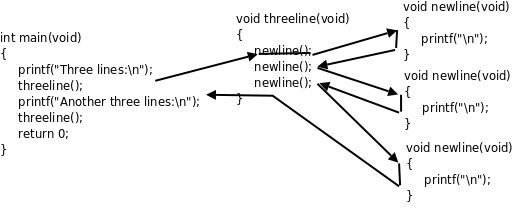

# Linux C编程一站式学习 —— C语言入门（Top Down）

## 第一章 程序的基本概念

### 1. 程序和编程语言

程序（Program）告诉计算机应如何完成一个计算任务，这里的计算可以是数学计算，比如：解方程，也可以是符号运算，比如：查找和替换文档中的某个单词。从根本上说，计算机是由数字电路组成的运算机器，只能对数字做运算，程序之所以能做符号运算，是因为符号在计算机内部也是用数字表示的。

程序由一系列指令（Instruction）组成，指令是指示计算机做某种运算的命令，通常包括以下几类：
* 输入（Input）
* 运算
* 输出（Output）
* 测试和分支
* 循环

任何一个程序，不管它有多么复杂，都是由这几类指令组成的。

编程语言（Programing Language）分为低级语言（low-level language）和高级语言（high-level language）。机器语言（machine language）和汇编语言（assembly language）属于低级语言，直接用于计算机指令编写程序。而C、C++、Java、Python等属于高级语言，用语句（statement）编写程序，语句是计算指令的抽象表示。

### 2. 自然语言和形式语言
自然语言（natural language）就是人类讲的语言，比如汉语、英语和法语等。
形式语言（formal language）是为了特定应用而认为设计的语言。例如数学家用的数字和运算符号、化学家用的分子式等。

形式语言有严格的语法（syntax）规则，例如，3+3=6是一个正确的数学等式，而3=+6$则不是。语法规则由符号（token）和结构（structure）的规则所组成的。token的概念相当于自然语言中的单词和标点、数学式中的数和运算符、化学分子式中的元素名和数字，例如3=+6$的问题之一在于$不是一个合法的数也不是一个事先定义好的运算符。结构是指token的排列方式，3=+6$还有一个结构上的错误，虽然加号和等号都是合法的运算符，但是不能在等号之后紧跟加号。关于token的规则称为词法（lexical）规则，而关于结构的规则称为语法（grammar）规则。

当阅读一个自然语言的句子或者一种形式语言的语句时，你不仅要搞清楚每个词（token）是什么意思，而且必须搞清楚整个句子的结构是什么样的。这个分析句子结构的过程称为解析（parse）。例如，当你听到"The other shoe fell."这个句子时，你理解the other shoe是主语，而fell是谓语动词，一旦解析完成，你就搞懂了句子的意思，如果知道shoe是什么东西，fell意味着什么，这句话是在什么上下文（context）中说的，你还能理解这个句子主要暗示的内容，这些都属于语义（semantic）的范畴。

现在给出一些关于阅读程序（包括其他形式语言）的建议。首先请记住形式语言远比自然语言紧凑，所以要多花点时间来读。其次，结构很重要，从上到下从左到右读往往不是一个好办法，而应该学会在大脑里解析：识别token，分解结构。最后，请记住细节的影响，诸如拼写错误和标点错误这些在自然语言中可以忽略的小毛病会把形式语言搞得面目全非。

### 3. 程序的调试
* 编译时错误
* 运行时错误（run-time）
* 逻辑错误和语义错误

### 4. 第一个程序
``` c
#include <stdio.h>

/* main: generate some simple output */
int main(void)
{
    printf("Hello, World.\n");
    return 0;
}
```

## 第二章 常量、变量和表达式

### 1. 继续Hello World
C语言的历史大致分为三个阶段：Old Style C、C89和C99。

C标准规定的转义字符：

转义字符      |含义
-------------|---------------
\\'          |单引号'（Single Quote或Apostrophe）
\\"          |双引号"
\\?          |问号?（question mark）
\\           |反斜线\（backslash）
\a           |响铃（alert或bell）
\b           |退格（backspace）
\f           |分页符（form feed）
\n           |换行（line feed）
\r           |回车（carriage return）
\t           |水平制表符（horizontal tab）
\v           |垂直制表符（vertical tab）

### 2. 常量
常量（constant）是程序中最基本的元素，有字符（character）常量、整数（integer）常量、浮点数（floating point）常量和枚举常量。

例：printf("character: %c\ninteger: %d\nfloating point: %f\n", '}', 34, 3.14);
printf中第一个字符串称为格式化字符串（format string），它规定了后面几个常量以何种格式插入到这个字符串中，在格式化字符串中%号（percent sign）后面加上字母c、d、f分别表示字符型、整型和浮点型的转换说明（conversion specification），转换说明只在格式化字符串中占个位置，并不出现在最终的打印结果中，这种用法通常叫做占位符（placeholder）。这也是一种字面意思与真实意思不同的情况，但是转换说明和转义序列又有区别：转义序列是编译时处理的，而转换说明是在运行时调用printf函数处理的。源文件中的字符串字面值是"character: %c\ninteger: %d\nfloating point: %f\n"，\n占两个字符，而编译之后保存在可执行文件中的字符串是character： %c换行integer: %d换行floating point: %f换行，\n已经被替换成一个换行符，而%c不变，然后在运行时这个字符串被传给printf，printf再把其中的%c、%d、%f解释成转换说明。

### 3. 变量
变量（variable）是编程语言最重要的概念之一，变量是计算机存储器中的一块命名空间，可以在里面存储一个值（value），存储的值是随时变的，比如这次存个字符'a'，下次存个字符'b'，正是因为变量的值可以随时变所以才叫变量。

变量的类型决定了它所占的存储空间的大小。

声明和定义：
C语言中的声明（declaration）有变量声明、函数声明和类型声明三种。
如果一个变量或函数的声明要求编译器为它分配存储空间，那么也可以称为定义（definition），因此定义是声明的一种。

C99 规定的关键字有：
auto  break  case  char  const  continue  default  do  double
else  enum  extern  float  for  goto  if  inline  int  long
register  restrict  return  short  signed  sizeof  static  struct  switch  typedef
union  unsigned  void  volatile  while  _Bool  _Complex  _Imaginary

请记住：理解一个概念不是把定义背下来就行了，一定要理解它的外延和内涵，也就是什么情况属于这个概念，什么情况不属于这个概念，什么情况虽然属于这个概念但一般推荐的做法（Best Practice）是要尽量避免这种情况，这才算是真正理解了。

### 4. 赋值
定义了变量之后，我们要把值存到它们所表示的存储空间里，可以用赋值（assignment）语句实现。

```c
int hour, minute;
hour = 23; /* assign the value 23 to hour */
minute = 59; /* set minute to 59 */
```
注意变量一定要先声明后使用，编译器必须先看到变量声明，才知道hour和minute是变量名，各自代表一块存储空间。另外，变量声明中的类型表明这个变量代表多大的一块存储空间，这样编译器才知道如何读写这块存储空间。

总结一下：给一个变量赋值，就是把一个值保存到这块存储空间中。变量的定义和赋值也可以一步完成，这称为变量的初始化（initialization）。

```c
int hour = 23, minute = 59;
```
在初始化语句中，等号右边的值叫做initializer，例如上面的23和59。注意：初始化是一种特殊的声明，而不是一种赋值语句。注意区分他们的不同。

### 5. 表达式
常量和变量都可以参与加减乘除运算，例如：1 + 1，hour - 1，hour * 60 + minute，minute / 60等。这里的+ - * / 称为运算符（operator），而参与运算的常量和变量称为操作数（operand），上面四个运算符和操作数所组成的算式称为表达式（expression）。

任何表达式都有值和类型两个基本属性。

同样优先级的运算符是从左到右计算还是从右到左计算称为运算符的结合性（associativity）。加减乘除是左结合，等号是右结合。

现在我们总结一下到目前为止学过的语法规则（注意，所列的语法规则都是简化过的，是不准确的，目的是为了便于理解）：
* 表达式 -> 标识符
* 表达式 -> 常量
* 表达式 -> 字符串字面值
* 表达式 -> (表达式)
* 表达式 -> 表达式 + 表达式
* 表达式 -> 表达式 - 表达式
* 表达式 -> 表达式 * 表达式
* 表达式 -> 表达式 / 表达式
* 表达式 -> 表达式 = 表达式
* 语句 -> 表达式;
* 语句 -> printf(表达式, 表达式, 表达式, ...);
* 变量声明 -> 类型 标识符 = Initialize, 标识符 = Initialize, ...; (= Initialize 的部分可以不写)

表达式可以是单个的常量或变量，也可以是根据以上规则组合而成的更复杂的表达式。例如：
```c
printf("%d:%d is %d minutes after 00:00\n", hour, minute, hour * 60 + minute);
```
编译器在翻译这条语句时，首先根据上述语法规则把这个语句解析成下图所示的语法树，然后再根据语法树生成相应的指令。语法树的末端的是一个个Token，每一步展开利用一条语法规则。


有的表达式既可以做左值也可以做右值，而有的表达式只能做右值。目前为止我们学过的表达式中只有变量可以做左值，后面还会学到几种做左值的表达式。

### 6. 字符类型和字符编码
字符常量或字符变量也可以当作整数参与运算，如：
```c
printf("%c\n", 'a' + 1); /* 执行结果是：b */
```
我们知道，符号在计算机内部也是用数字表示，每个字符在计算机内部用一个整数表示，称为字符编码（character encoding），目前最常用的是ASCII码（American Standard Code for Information Interchange，美国信息交换标准码）。

回到刚才的例子，在ASCII码中字符a是97，字符b是98。计算'a'+1这个表达式，应该按ASCII码把'a'当作整数值97，然后加1，得到98，然后printf把98这个整数值当作ASCII码来解释，打印出相应的字符b。

之前我们说“整型”是指int型，而现在我们知道char型本质上就是整数，只不过取值范围比int型小，所以以后我们把char型和int型统称为整数类型（integer type）或简称整型。

字符也可以用ASCII码转义序列表示，这种转义序列由\加上1~3个八进制数字组成，或者由\x或大写\X加上1~2个十六进制数字组成，可以用在字符常量或字符串字面值中。例如'\0'表示NUL字符（Null Character），'\11'或'\x9'表示Tab字符，"\11"或"\x9"表示由Tab字符组成的字符串。注意'0'的ASCII码是48，而'\0'的ASCII码是0，两者是不同的。

## 第三章 简单函数

### 1. 数学函数
在数学中我们用过sin和ln这样的函数，例如sin(π/2)=1，ln1=0等等，在C语言中也可以使用这些函数：

```c
#include <stdio.h>
#include <math.h>

int main(void) {
    double pi = 3.1416;
    printf("sin(pi/2)=%f\nln1=%f\n", sin(pi/2), log(1.0));
    return 0;
}
```
编译运行结果如下：
```bash
$ gcc -lm main.c
$ ./a.out
sin(pi/2)=1.000000
ln1=0.000000
```

在C语言的术语中，1.0是参数（argument），log是函数（function），log(1.0)是函数调用（function call）。sin(pi/2)和log(1.0)这两个函数调用我们的printf语句中处于什么位置呢？在上一章讲过，这应该是表达式的位置。因此函数调用也是一种表达式，这个表达式由函数调用运算符（()括号）和两个操作数组成，操作数log是一个函数名（function designator），它的类型是一种函数类型（function type），操作数1.0是double型的。log(1.0)这个表达式的值就是对数运算的结果，也是double型的，在C语言中函数调用表达式的值称为函数的返回值（return value）。总结一下我们新学的语法规则：
* 表达式 -> 函数名
* 表达式 -> 表达式(参数列表)
* 参数列表 -> 表达式, 表达式, ...

C标准库和glibc
C标准主要由两部分组成，一部分描述C的语法，另一部分描述C标准库。C标准库定义了一组标准头文件，每个头文件中包含一些相关的函数、变量、类型声明和宏定义。要在一个平台上支持C语言，不仅要实现C编译器，还要实现C标准库，这样的实现才算是符合C标准。
在Linux平台上最广泛使用的C函数库是glibc，其中包括C标准库的实现，也包括本书第三部分介绍的所有系统函数。几乎所有C程序都要调用glibc的库函数，所以glibc是Linux平台C程序运行的基础。glibc提供一组头文件和一组库文件，最基本、最常用的C标准库函数和系统函数在libc.so库文件中，几乎所有C程序的运行都依赖于libc.so，有些做数学计算的C程序依赖于libm.so，以后我们还会看到多线程的C程序依赖于libpthread.so。以后我们说libc时专指libc.so这个库文件，而说glibc时指的是glibc提供的所有库文件。

### 2. 自定义函数
我们不仅可以调用C标准库提供的函数，也可以定义自己的函数。

```c
int main(void) {
    int hour = 11;
    int minute = 59;
    printf("%d and %d hours\n", hour, minute / 60);
    return 0;
}
```
我们对照着main函数的定义来看语法规则：
* 函数定义 -> 返回值类型 函数名(参数列表) 函数体
* 函数体 -> {语句列表}
* 语句列表 -> 语句列表项, 语句列表项, ...
* 语句列表项 -> 语句
* 语句列表项 -> 变量声明、类型声明或非定义的函数声明
* 非定义的函数声明 -> 返回值类型 函数名(参数列表)

```c
#include <stdio.h>

void newline(void)
{
	printf("\n");
}

void threeline(void)
{
	newline();
	newline();
	newline();
}

int main(void)
{
	printf("Three lines:\n");
	threeline();
	printf("Another three lines.\n");
	threeline();
	return 0;
}
```
通过这个简单的例子可以体会到：
1. 同一个函数可以被多次调用。
2. 可以用一个函数调用另外一个函数，后者再去调第三个函数。
3. 通过自定义函数可以给一组复杂的操作起一个简单的名字，例如：threeline。对于main函数来说，只需要通过threeline这个简单的名字来调用就行了，不必知道打印三个空行具体怎么做，所有复杂操作都被隐藏在threeline这个名字后面。
4. 使用自定义函数可以使代码更简洁，main函数在任何地方想打印三个空行只需要调用一个简单的threeline()，而不必每次都写三个printf("\n")。

函数调用的执行顺序：



读代码的过程就是模仿计算机执行程序的过程，我们不仅要记住当前读到了哪一行代码，还要记住现在读的代码被哪个函数调用，这段代码返回后应该从上一个函数的什么地方接着往下读。

现在澄清一下函数声明、函数定义、函数原型（prototype）这几个概念。比如void threeline(void)这一行，声明了一个函数的名字、参数类型和个数、返回值类型，这称为函数原型。在代码中可以单独写一个函数原型，后面加;号结束，而不写函数体，例：
```c
void threeline(void);
```
这种写法只能叫函数声明而不能叫函数定义，只有带函数体的声明才叫定义。上一章讲过，只有分配存储空间的变量声明才叫变量定义，其实函数也是一样，编译器只有见到函数定义才会生成指令，而指令在程序运行时当然也要占存储空间。那么没有函数体的函数声明有什么用呢？它为编译器提供了有用的信息，编译器在翻译代码的过程中，只有见到函数原型（不管带不带函数体）之后才知道这个函数的名字、参数类型和返回值，这样碰到函数调用时才知道怎么生成相应的指令，所以函数原型必须出现在函数调用之前，这也是遵循“先声明后使用”的原则。

### 3. 形参和实参
我们需要在函数定义中指明参数的个数和每个参数的类型，定义参数就像定义变量一样，需要为每个参数指明类型，参数的命名也要遵守标识符命名规则。例如：
```c
#include <stdio.h>

void print_time(int hour, int minute)
{
	printf("%d:%d\n", hour, minute);
}

int main(void)
{
	print_time(23, 59);
	return 0;
}
```
我们调用print_time(23, 59)时，函数中的参数hour就代表23，参数minute就代表59。确切地说，当我们讨论函数中的hour这个参数时，我们所说的“参数”是指形参（Parameter），当我们讨论传一个参数23给函数时，我们所说的“参数”是指实参（Argument），但我习惯都叫参数而不习惯总把形参、实参这两个文绉绉的词挂在嘴边（事实上大多数人都不习惯），读者可以根据上下文判断我说的到底是形参还是实参。记住这条基本原理：形参相当于函数中定义的变量，调用函数传递参数的过程相当于定义形参变量并且用实参的值来初始化。

Man Page:
Man Page是Linux开发最常用的参考手册，由很多页面组成，每个页面描述一个主题，这些页面被组织成若干个Section。FHS（Filesystem Hierarchy Standard）标准规定了Man Page各Section的含义如下：

section  | 描述
---------|---------------
1        | 用户命令，例如ls(1)
2        | 系统调用，例如_exit(2)
3        | 库函数，例如printf(3)
4        | 特殊文件，例如null(4)描述了设备文件/dev/null、/dev/zero的作用
5        | 系统配置文件的格式，例如passwd(5)描述了系统配置文件/etc/passwd的格式
6        | 游戏
7        | 其它杂项，例如bash-builtins(7)描述了bash的各种内建命令
8        | 系统管理命令，例如ifconfig(8)

```bash
main 3 printf # 查看位于第3个section的printf函数
main -k printf # 搜索哪些页面的主题包含printf关键字
```

### 4. 全局变量、局部变量和作用域
变量作用域和生命周期：
1. 局部变量  
局部变量作用域：函数内部  
局部变量的生命周期：离开函数，自动销毁  

2. 全局变量  
全局变量作用域：全局变量，所有函数共享，在任何地方出现这个变量名都是指向这个全局变量，除非在函数内部被重新定义  
全局变量生命周期：整个程序结束才释放  

3. 局部静态变量   
局部静态变量作用域：函数内部  
局部静态变量生命周期：整个程序结束才释放  

4. 全局静态变量  
全局静态变量作用域：只能在定义该变量的文件中使用  
全局静态变量的生命周期：整个程序结束才释放  

## 第四章 分支语句

### 1. if语句
有时候我们需要检查一个条件，然后根据检查的结果执行不同的后续代码，在C语言中可以用分支语句（selection statement）实现，比如：
```c
if (x != 0) {
    printf("x is nonzero.\n");
}
```

关系运算符和相等性运算符

运算符   | 含义
--------|-------
==      | 等于
!=      | 不等于
\>      | 大于
<       | 小于
\>=     | 大于或等于
<=      | 小于或等于

和if语句相关的语法规则如下：
* 语句 -> if (控制表达式) 语句
* 语句 -> {语句列表}
* 语句 -> ;

在C语言中，任何允许出现语句的地方既可以是由;号结尾的一条语句，也可以是由{}号括起来的若干条语句或声明组成的语句块（statement block），语句块和上一章介绍的函数体的语法相同。注意语句块的}后面不需要加;号。如果}号后面加了;号，则这个;号又是一条新的语句了，在C语言中一个单独的;号表示一条空语句（null statement）。

### 2. if/else语句
```c
if (x % 2 == 0) {
    printf("x is even.\n");
} else {
    printf("x is odd.\n");
}
```
注意：else总是和它上面最近的一个if配对。

### 3. 布尔代数

AND的真值表:
A | B | A AND B
--|---|--------
0 | 0 | 0
0 | 1 | 0
1 | 0 | 0
1 | 1 | 1

OR的真值表：
A | B | A OR B
--|---|--------
0 | 0 | 0
0 | 1 | 1
1 | 0 | 1
1 | 1 | 1

NOT的真值表：
A | NOT A
--|--------
0 | 1
1 | 0

逻辑非运算符只有一个操作数，称为单目运算符（unary operator），以前讲过的加减乘除、赋值、相等性、关系、逻辑与、逻辑或运算符都有两个操作数，称为双目运算符（binary operator）。

### 4. switch语句
switch 语句可以产生具有多个分支的控制流程。它的格式是：
```
switch (控制表达式) {
    case 常量表达式: 语句列表
    case 常量表达式: 语句列表
    ...
    default: 语句列表
}
```

## 第五章 深入理解函数

### 1. return 语句
在有返回值的函数中，return语句的作用是提供整个函数的返回值，并结束当前函数返回到调用它的地方。在没有返回值的函数中也可以使用return语句，例如当检查到一个错误时提前结束函数的执行并返回。

```c
#include <math.h>

void print_logarithm(double x)
{
	if (x <= 0.0) {
		printf("Positive numbers only, please.\n");
		return;
	}
	printf("The log of x is %f", log(x));
}
```

返回布尔值的函数是一类非常有用的函数，在程序中通常充当控制表达式，函数名通常带有is或if等表示判断的词，这类函数也叫做谓词（Predicate）。

```c
int is_even(int x)
{
	return !(x % 2);
}
```

### 2. 增量式开发
目前为止你看到了很多示例代码，也在它们的基础上做了很多改动并在这个过程中巩固所学的知识。但是如果从头开始编写一个程序解决某个问题，应该按什么步骤来写呢？本节提出一种增量式（Incremental）开发的思路，很适合初学者。

现在问题来了：我们要编一个程序求圆的面积，圆的半径以两个端点的座标(x1, y1)和(x2, y2)给出。首先分析和分解问题，把大问题分解成小问题，再对小问题分别求解。这个问题可分为两步：

1. 由两个端点坐标求半径的长度，我们知道平面上两点间距离的公式是：
   distance = √((x2-x1)2+(y2-y1)2)
   括号里的部分都可以用我们学过的C语言表达式来表示，求平方根可以用math.h中的sqrt函数，因此这个小问题全部都可以用我们学过的知识解决。这个公式可以实现成一个函数，参数是两点的坐标，返回值是distance。
2. 上一步算出的距离是圆的半径，已知圆的半径求面积的公式是：
   area = π·radius2
   也可以用我们学过的C语言表达式来解决，这个公式也可以实现成一个函数，参数是radius

如果不确定程序这样写行不行时，那么就此打住，然后编译、运行。看看有没有报错，是不是我们想要的结果。这样增量式的开发非常适合初学者，每写一行代码都编译运行，一方面在写代码时更有信心，另一方面也方便了调试：总是有一个先前的正确版本做参照，改动之后如果出了问题，几乎可以肯定就是刚才改的那行代码出的问题，这样避免了必须从很多行代码中查找分析到底是哪一行出的问题。

解决问题的过程是把大的问题分成小的问题，小的问题再分成更小的问题，这个过程在代码中的体现就是函数的分层设计（Stratify）。distance和area是两个底层函数，解决一些很小的问题，而area_point是一个上层函数，上层函数通过调用底层函数来解决更大的问题，底层和上层函数都可以被更上一层的函数调用，最终所有的函数都直接或间接地被main函数调用。如下图所示：


尽可能复用（Reuse）以前写的代码，避免写重复的代码。封装就是为了复用，把解决各种小问题的代码封装成函数，解决第一个大问题时可以用这些函数，在解决第二个大问题时可以复用这些函数。

### 3. 递归
如果定义一个概念需要用到这个概念本身，我们称它的定义是递归的（Recursive）。

数学上有很多概念是用它自己来定义的，比如n的阶乘（Factorial）是这样定义的：n的阶乘等于n乘以n-1的阶乘。如果这样定义就算完了，那么n-1的阶乘是什么？是n-1乘以n-2的阶乘。那n-2的阶乘又是什么？这样下去永远也没完。因此需要定义一个最关键的基础条件（Base Case）：0的阶乘等于1。

```c
int factorial(int n)
{
    if (n == 0) {
        return 1;
    } else {
        int recurse = factorial(n - 1);
        int result = n * recurse;
        return result;
    }
}
```
自己直接或间接调用自己的函数称为递归函数。这里的factorial是直接调用自己，有些时候函数A调用函数B，函数B又调用函数A，也就是函数A间接调用自己，这也是递归函数。我们以factorial(3)为例分析下整个调用过程，如下图所示：

的调用过程")

图中用实线箭头表示调用，用虚线箭头表示返回，右侧的框表示在调用和返回过程中各层函数调用的存储空间变化情况。
1. main()有一个局部变量result，用一个框表示。
2. 调用factorial(3)时要分配参数和局部变量的存储空间，于是在main()的下面又多了一个框表示factorial(3)的参数和局部变量，其中n已初始化为3。
3. factorial(3)又调用factorial(2)，又要分配factorial(2)的参数和局部变量，于是在main()和factorial(3)下面又多了一个框。第 4 节 “全局变量、局部变量和作用域”讲过，每次调用函数时分配参数和局部变量的存储空间，退出函数时释放它们的存储空间。factorial(3)和factorial(2)是两次不同的调用，factorial(3)的参数n和factorial(2)的参数n各有各的存储单元，虽然我们写代码时只写了一次参数n，但运行时却是两个不同的参数n。并且由于调用factorial(2)时factorial(3)还没退出，所以两个函数调用的参数n同时存在，所以在原来的基础上多画一个框。
4. 依此类推，请读者对照着图自己分析整个调用过程。读者会发现这个过程和前面我们用数学公式计算3!的过程是一样的，都是先一步步展开然后再一步步收回去。

我们看上图右侧的变化过程，随着函数调用的层层深入，存储空间的一端逐渐增长，然后随着函数调用的层层返回，存储空间的这一端又逐渐缩短，并且每次访问参数和局部变量时只能访问这一端的存储单元，而不能访问内部的存储单元，比如当factorial(2)的存储空间位于末端时，只能访问它的参数和局部变量，而不能访问factorial(3)和main()的参数和局部变量。具有这种性质的数据结构称为堆栈或栈（stack），随着函数调用和返回而不断变化的这一端称为栈顶，每个函数调用的参数和局部变量的存储空间（如上图的每个小方框）称为一个栈帧（stack frame）。操作系统为程序的运行预留了一块空间，函数调用时就在这个栈空间里分配栈帧，函数返回时就释放栈帧。

递归绝不只是为解决一些奇技淫巧的数学题而想出来的招，它是计算机的精髓所在，也是编程语言的精髓所在。我们学习在C的语法时已经看到很多递归定义了，例如在第 1 节 “数学函数”讲过的语法规则中，“表达式”就是递归定义的：

* 表达式 -> 表达式(参数列表)
* 参数列表 -> 表达式, 表达式, ...

再比如在第 1 节 “if语句”讲过的语规则中，“语句”也是递归定义的：

* 语句 -> if (控制表达式) 语句

可见编译器在解析我们写的程序时一定也用了大量的递归。

## 第六章 循环语句

### 1. while语句
```c
int factorial(int n)
{
    int result = 1;
    while (n > 0) {
        result = result * n;
        n = n - 1;
    }
    return result;
}
```
和if语句类似，while语句由一个控制表达式和一个子语句组成，子语句可以是由若干条语句组成的语句块：
* 语句 -> while (控制表达式) 语句

### 2. do/while语句
do/while语句的语法是：
* 语句 -> do 语句 while (控制表达式)

```c
int factorial(int n)
{
    int result = 1;
    int i = 1;
    do {
        result = result * i;
        i = i + 1;
    } while (i <= n);
    return result;
}
```

### 3. for语句
for语句的语法是：
* for (控制表达式1; 控制表达式2; 控制表达式3) 语句

```c
int factorial(int n)
{
	int result = 1;
	int i;
	for(i = 1; i <= n; ++i)
		result = result * i;
	return result;
}
```
++i这个表达式相当于i = i + 1，++称为前缀自增运算符（prefix increment operator），类似的，--称为前缀自减运算符（prefix decrement operator），--i相当于i = i - 1。如果把++i这个表达式看作一个函数调用，除了传入一个参数返回一个值（等于参数值加1）之外，还产生一个Side Effect，就是把变量i的值增加了1。

++和--运算符也可以用在变量后面，例如i++和i--，为了和前缀运算符区别，这两个运算符称为后缀自增运算符（Postfix Increment Operator）和后缀自减运算符（Postfix Decrement Operator）。如果把i++这个表达式看作一个函数调用，传入一个参数返回一个值，返回值就等于参数值（而不是参数值加1），此外也产生一个Side Effect，就是把变量i的值增加了1，它和++i的区别就在于返回值不同。同理，--i返回减1之后的值，而i--返回减1之前的值，但这两个表达式都产生同样的Side Effect，就是把变量i的值减了1。

### 4. break和continue语句
break语句用来跳出循环体。
continue语句跳出当前循环后又回到循环体的开头准备执行下一次循环。

### 5. 嵌套循环
```c
#include <stdio.h>

int main(void)
{
	int i, j;
	for (i = 1; i <= 100; i++) {
		for (j = 2; j < i; j++)
			if (i % j == 0)
				break;
		if (j == i)
			printf("%d\n", i);
	}
	return 0;
}
```

### 6. goto语句和标号
goto语句实现无条件跳转。我们知道break只能跳出最内层的循环，如果在一个嵌套循环中遇到某个错误条件需要立即跳出最外层循环做出错处理，就可以用goto语句，例如：

```
for (...)
	for (...) {
		...
		if (出现错误条件)
			goto error;
	}
error:
	出错处理;
```
这里的error:叫做标号（Label），任何语句前面都可以加若干个标号，每个标号的命名也要遵循标识符的命名规则。

和标号有关的语法规则如下：
* 语句 -> 标识符: 语句
* 语句 -> case 常量表达式: 语句
* 语句 -> default: 语句

注意：滥用goto语句会使程序的控制流程非常复杂，可读性很差。

## 第七章 结构体

### 1. 复合类型和结构体
在编程语言中，最基本的、不可分割的数据类型称为基本类型（primitive type），例如整型、浮点型；根据语法规则由基本类型组合而成的类型称为复合类型（compound type），例如字符串是由很多字符组成。有些场合下要把复合类型当作一个整体来用，而另外一些场合下需要分解组成这个复合类型的各种基本类型，复合类型的这种两面性为数据抽象（data abstraction）奠定了基础。SICP指出，在学习一门编程语言时要特别注意以下三个方面：
1. 这门语言提供了哪些primitive，比如基本类型，比如基本运算符、表达式和语句。
2. 这门语言提供了哪些组合规则，比如基本类型如何组成复合类型，比如简单的表达式和语句如何组成复杂的表达式和语句。
3. 这门语言提供了哪些抽象机制，包括数据抽象和过程抽象（procedure abstraction）。

本章以结构体为例讲解数据类型的组合和数据抽象。至于过程抽象，我们在第 2 节 “if/else语句”已经见过最简单的形式，就是把一组语句用一个函数名封装起来，当作一个整体使用，本章将介绍更复杂的过程抽象。

现在我们用C语言表示一个复数。我们可以写成由两个double型组成的结构体：

```c
struct complex_struct {
    double x, y;
};
```
这一句定义了标识符complex_struct（同样遵守标识符的命名规则），这种标识符在C语言中称为Tag，struct complex_struct {double x, y;} 整个可以看作是一个类型名，就像int或double一样，只不过它是一个复合类型，如果用这个类型名来定义变量，可以这样写：

```c
struct complex_struct {
    double x, y;
} z1, z2;
```
这样z1和z2就是两个变量名。也可以这样定义另外两个复数变量：

```c
struct complex_struct z3, z4;
```

如果在定义结构体类型的同时定义了变量，也可以不用写tag，例如：

```c
struct {
    double x, y;
} z5, z6;
```
但这样就没办法再次引用这个结构体类型了，因为它没有名字。每个变量都有两个成员（member）x和y，可以用.运算符（.号，period）来访问，这两个成员的存储空间是相邻的，合在一起组成复数变量的存储空间。看下面的例子：

```c
#include <stdio.h>

/* 定义和访问结构体 */
int main(void)
{
    struct complex_struct {
        double x, y;
    } z;

    double x = 3.0;
    z.x = x;
    z.y = 4.0;
    if (z.y < 0)
		printf("z=%f%fi\n", z.x, z.y);
	else
		printf("z=%f+%fi\n", z.x, z.y);
    return 0;
}
```
结构体变量也可以在定义时初始化，例如：
```c
struct complex_struct z = {3.0, 4.0};
```
initializer中的数据依次赋给结构体的各成员。如果initializer中的数据比结构体的成员多，编译器会报错，但是如果只是末尾多个逗号则不算错。如果initializer中的数据比结构体的成员少，未指定的成员将用0来初始化，就像未初始化的全局变量一样。例如以下几种形式的初始化都是合法的：
```c
double x = 3.0;
struct complex_struct z1 = {x, 4.0, }; /* z1.x=3.0, z1.y=4.0 */
struct complex_struct z2 = {3.0, }; /* z2.x=3.0, z2.y=0.0 */
struct complex_struct z3 = {0}; /* z3.x=0.0, z3.y=0.0 */
```
注意，z1必须是局部变量才能使用另一个变量x的值来初始化它的成员，如果是全局变量就只能用常量表达式来初始化。这也是C99的新特性，C89只允许在{}中使用常量表达式来初始化，无论是初始化全局变量还是局部变量。

{}这种语法不能用于结构体的赋值，例如这样是错误的：
```c
struct complex_struct z1;
z1 = {3.0, 4.0};
```
C99引入一种新的表达式语法Compound Literal可以用来赋值，例如`z1 = (struct complex_struct){ 3.0, 4.0 };`，本书不使用这种新语法。

以前我们初始化基本类型的变量所使用的initializer都是表达式，表达式当然也可以用来赋值，但现在这种由{}括起来的initializer并不是表达式，所以不能用来赋值。initializer的语法总结如下：
* initializer -> 表达式
* initializer -> {初始化列表}
* 初始化列表 -> designated-initializer, designated-initializer, ...（最后一个designated-initializer末尾可以有一个多余的,号）
* designated-initializer -> initializer
* designated-initializer -> .标识符 = initializer
* designated-initializer -> [常量表达式] = initializer

Designated initializer是C99引入的新特性，用于初始化稀疏（Sparse）结构体和稀疏数组很方便。有些时候结构体或数组中只有某一个或某几个成员需要初始化，其他成员都用0初始化即可，用designated initializer语法可以针对每个成员做初始化（Memberwise Initialization），很方便。例如：
```c
struct complex_struct z1 = {.y = 4.0}; /* z1.x=0.0, z1.y=4.0 */
```

结构体类型用在表达式中有很多限制，不像基本类型那么自由，比如+ - * /等算术运算符和&& || !等逻辑运算符都不能作用于结构体类型，if语句、while语句中的控制表达式的值也不能是结构体类型。严格来说，可以做算术运算的类型称为算术类型（Arithmetic Type），算术类型包括整型和浮点型。可以表示零和非零，可以参与逻辑与、或、非运算或者做控制表达式的类型称为标量类型（Scalar Type），标量类型包括算术类型和以后要讲的指针类型。

用一个结构体变量初始化另一个结构体变量也是允许的，例如：
```c
struct complex_struct z1 = {3.0, 4.0};
struct complex_struct z2 = z1;
z1 = z2;
```
同样，z2必须是局部变量才能用变量z1的值来初始化。既然结构体变量之间可以相互赋值和初始化，也就可以当作函数的参数和返回值来传递：
```c
struct complex_struct add_complex(struct complex_struct z1, struct complex_struct z2)
{
    z1.x = z1.x + z2.x;
    z1.y = z1.y + z2.y;
    return z1;
}
```
这个函数实现了两个复数相加，如果在main函数中可以这样调用：
```c
struct complex_struct z = {3.0, 4.0};
z = add_complex(z, z);
```
调用传参的过程如下图所示：


变量z在main函数的栈帧上，参数z1和z2是在add_complex函数的栈帧上，z的值分别赋值给z1和z2。在这个函数里，z2的实部和虚部被累加到z1中，然后return z1;可以看成是：

1. 用z1初始化一个临时变量。
2. 函数返回并释放栈帧。
3. 把临时变量的值赋值给变量z，释放临时变量。 

### 2. 数据抽象
现在我们来实现一个完整的复数运算程序：
```c
#include <math.h>

struct complex_struct {
	double x, y;
};

double real_part(struct complex_struct z)
{
	return z.x;
}

double img_part(struct complex_struct z)
{
	return z.y;
}

double magnitude(struct complex_struct z)
{
	return sqrt(z.x * z.x + z.y * z.y);
}

double angle(struct complex_struct z)
{
	return atan2(z.y, z.x);
}

struct complex_struct make_from_real_img(double x, double y)
{
	struct complex_struct z;
	z.x = x;
	z.y = y;
	return z;
}

struct complex_struct make_from_mag_ang(double r, double A)
{
	struct complex_struct z;
	z.x = r * cos(A);
	z.y = r * sin(A);
	return z;
}

struct complex_struct add_complex(struct complex_struct z1, struct complex_struct z2)
{
	return make_from_real_img(real_part(z1) + real_part(z2),
				  img_part(z1) + img_part(z2));
}

struct complex_struct sub_complex(struct complex_struct z1, struct complex_struct z2)
{
	return make_from_real_img(real_part(z1) - real_part(z2),
				  img_part(z1) - img_part(z2));
}

struct complex_struct mul_complex(struct complex_struct z1, struct complex_struct z2)
{
	return make_from_mag_ang(magnitude(z1) * magnitude(z2),
				 angle(z1) + angle(z2));
}

struct complex_struct div_complex(struct complex_struct z1, struct complex_struct z2)
{
	return make_from_mag_ang(magnitude(z1) / magnitude(z2),
				 angle(z1) - angle(z2));
}
```

数据抽象：


这里的复数存储表示层和复数运算层称为抽象层（Abstraction Layer），从底层往上层来看，复数越来越抽象了，把所有这些层组合在一起就是一个完整的系统。组合使得系统可以任意复杂，而抽象使得系统的复杂性是可以控制的，任何改动都只局限在某一层，而不会波及整个系统。

### 3. 数据类型标志
在上一节中，我们通过一个复数存储表示抽象层把complex_struct结构体的存储格式和上层的复数运算函数隔开，complex_struct结构体既可以采用直角座标也可以采用极座标存储。但有时候需要同时支持两种存储格式，比如先前已经采集了一些数据存在计算机中，有些数据是以极座标存储的，有些数据是以直角座标存储的，如果要把这些数据都存到complex_struct结构体中怎么办？一种办法是规定complex_struct结构体采用直角座标格式，直角座标的数据可以直接存入complex_struct结构体，而极座标的数据先转成直角座标再存，但由于浮点数的精度有限，转换总是会损失精度的。这里介绍另一种办法，complex_struct结构体由一个数据类型标志和两个浮点数组成，如果数据类型标志为0，那么两个浮点数就表示直角座标，如果数据类型标志为1，那么两个浮点数就表示极座标。这样，直角座标和极座标的数据都可以适配（Adapt）到complex_struct结构体中，无需转换和损失精度：
```c
enum coordinate_type {RECTANGULAR, POLAR};
struct complex_struct {
    enum coordinate_type t;
    double x, y;
};
```
enum关键字的作用和struct关键字类似，把coordinate_type这个标识符定义为一个Tag，struct complex_struct表示一个结构体类型，而enum coordinate_type表示一个枚举（Enumeration）类型。枚举类型的成员是常量，它们的值由编译器自动分配，例如定义了上面的枚举类型之后，RECTANGULAR就表示常量0，POLAR表示常量1。如果不希望从0开始分配，可以这样定义：
```c
enum coordinate_type {RECTANGULAR = 1, POLAR};
```
这样，RECTANGULAR就表示常量1，而POLAR表示常量2。枚举常量也是一种整型，其值在编译时确定，因此也可以出现在常量表达式中，可以用于初始化全局变量或者作为case分支的判断条件。

注意：结构体的成员变量和变量名不在同一命名空间中，但枚举的成员名却和变量名在同一命名空间中，所以会出现命名冲突。例如这样是不合法的：
```c
int main()
{
    enum coordinate_type {RECTANGULAR, POLAR};
    int RECTANGULAR; /* 命名冲突 */
    printf("%d %d\n", RECTANGULAR, POLAR);
	return 0;
}
```
complex_struct结构体的格式变了，就需要修改上节复数存储表示层的函数，但只要保持函数接口不变就不会影响到上层函数。例如：
```c
struct complex_struct make_from_real_img(double x, double y)
{
	struct complex_struct z;
	z.t = RECTANGULAR;
	z.a = x;
	z.b = y;
	return z;
}

struct complex_struct make_from_mag_ang(double r, double A)
{
	struct complex_struct z;
	z.t = POLAR;
	z.a = r;
	z.b = A;
	return z;
}
```

### 4. 嵌套结构体
结构体也是一种递归定义：结构体的成员具有某种数据类型，而结构体本身也是一种数据类型。换句话说，结构体的成员可以是另一个结构体，即结构体可以嵌套定义。例如我们在复数的基础上定义复平面上的线段：
```c
struct segment {
    struct complex_struct start;
    struct complex_struct end;
}

/* 嵌套的初始化嵌套结构体 */
struct segment s1 = {{1.0, 2.0}, {4.0, 6.0}};

/* 平坦（Flat）的初始化嵌套结构体 */
struct segment s2 = {1.0, 2.0, 4.0, 6.0};

/* C99新特性 */
struct segment s3 = {.start.x = 1.0, .end.x = 2.0};

/* 访问嵌套结构体成员 */
s.start.x = 1.0;
s.end.x = 3.0;
```

## 第八章 数组

### 1. 数组的基本概念
数组（Array）也是一种复合数据类型，它由一系列相同类型的元素（element）组成。
```c
/* 由4个int型元素组成的数组count */
int count[4];
```
和结构体成员类似，数组count的4个元素的存储空间也是相邻的。结构体成员可以是基本类型，也可以是复合数据类型，数组中的元素也是如此。根据组合规则，我们可以定义一个由4个结构体组成的数组：
```c
/* 定义一个结构体类型的数组 a */
struct complex_struct {
    double x, y;
} a[4];

/* 初始化 */
struct complex_struct {
    double x, y;
} a[4] = {{1.0, 2.0}, {3.0, 6.0}, {4.0, 8.0}, {1.0, 9.0}};

/* 访问数组成员 */
for (int i = 0; i < 4; i++) {
    printf("a[%d].x = %f, a[%d].y = %f\n", i, a[i].x, i, a[i].y);
}
```
也可以定义一个包含数组成员的结构体：
```c
struct {
    double x, y;
    int count[4];
} s;

/* 赋值 */
s.x = 3.0;
s.y = 6.0;
s.count[0] = 12;
s.count[1] = 6;
s.count[2] = 3;
s.count[3] = 11;

/* 调用 */
printf("s.x = %f, s.y = %f\n", s.x, s.y);

for (int i = 0; i < 4; i++) {
    printf("s.count[%d] = %d\n", i, s.count[i]);
}
```

### 2. 数组的应用实例：统计随机数
### 3. 数组的应用实例：直方图
### 4. 字符串
### 5. 多维数组

## C语言本质（Bottom Up）

## Linux系统编程