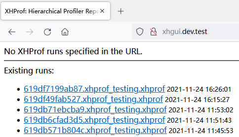
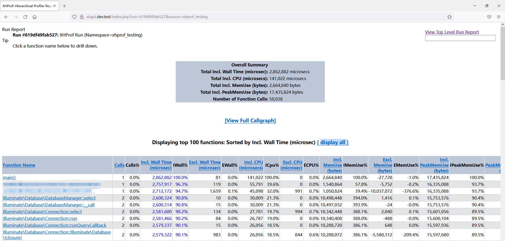
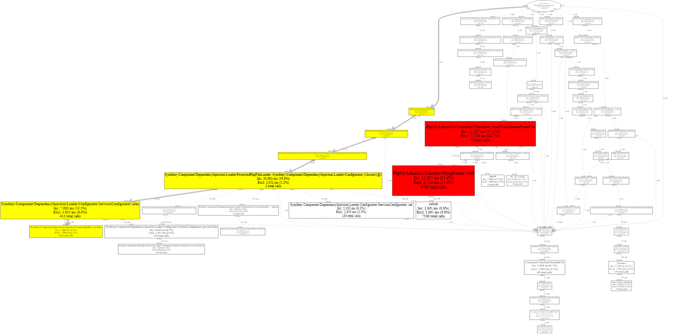

# PHP 性能分析器 XHProf 使用教程

最近公司服务器负载异常，排查了一圈后发现某些接口存在性能问题。于是决定使用 PHP 的性能分析器 Xhprof 对其进行性能分析，将其过程记录如下，方便自己查阅也希望能够帮助到别人。

## 安装 [XHProf](https://github.com/longxinH/xhprof) 扩展

```bash
git clone https://github.com/longxinH/xhprof.git ./xhprof
cd xhprof/extension/
/path/to/php7/bin/phpize --with-php-config=/path/to/php7/bin/php-config
./configure --with-php-config=/path/to/php7/bin/php-config
make && sudo make install
```

## 修改 php.ini 配置文件

```bash
# 将下面内容添加到 php.ini 配置文件
[xhprof]
extension=xhprof.so
xhprof.output_dir=/tmp/xhprof # 记得要給日志路径读写权限(sudo chmod -R 777 /tmp/xhprof)

# 查看扩展
php -m | grep xhprof

# 查看扩展版本等信息
php --ri xhprof
```

## 示例

```php
<?php
// 启动 xhprof 性能分析器
// XHPROF_FLAGS_NO_BUILTINS 使得跳过所有内置（内部）函数
// XHPROF_FLAGS_CPU 使输出的性能数据中添加 CPU 数据
// XHPROF_FLAGS_MEMORY 使输出的性能数据中添加内存数据
xhprof_enable(XHPROF_FLAGS_CPU + XHPROF_FLAGS_MEMORY);

for ($i = 0; $i <= 1000; $i++) {
    $a = $i * $i;
}

// 停止 xhprof 性能分析
$xhprof_data = xhprof_disable();

// 引入 xhprof 相关类库(我们下载的源码中已经包含了这两个文件，我们可以将 xhprof_lib 目录复制到项目目录中，然后再引入。)
$XHPROF_ROOT = "/tools/xhprof/";
include_once $XHPROF_ROOT . "/xhprof_lib/utils/xhprof_lib.php";
include_once $XHPROF_ROOT . "/xhprof_lib/utils/xhprof_runs.php";

// 记录性能分析报告
$xhprof_runs = new XHProfRuns_Default();
$run_id = $xhprof_runs->save_run($xhprof_data, "xhprof_testing");

echo "http://localhost/xhprof/xhprof_html/index.php?run={$run_id}&source=xhprof_testing\n";

?>
```

## 可视化性能分析报告

在之前我们下载的源码里将 xhprof_html 目录和 xhprof_lib 目录复制出来，然后单独配置成一个可访问的站点。

```bash
# 新建一个目录
mkdir -p /home/wwwroot/xhprof

# 将 xhprof_html 目录和 xhprof_lib 目录复制到刚才新建的目录中
cp -a /usr/local/src/xhprof/xhprof_html/ /usr/local/src/xhprof/xhprof_lib/ /home/wwwroot/xhprof

# 新建 Web 站点(本机使用的是 lnmp 一键安装包)，具体步骤就不再赘述
lnmp vhost add 
```

配置好后我们来访问这个站点，可以看到如下页面，他会显示出所有我们已经分析完成的报告，



点击某个报告之后会进入详情页（点击标头可以进行排序）：



参数含义：

* Total Incl. Wall Time (microsec): 总执行时间
* Total Incl. CPU (microsecs): 总的 CPU 耗时
* Total Incl. MemUse (bytes): 总的内存消耗
* Total Incl. PeakMemUse (bytes): 内存消耗峰值
* Number of Function Calls: 总的调用次数
* Function Name 函数名
* Calls 调用次数
* Calls% 调用次数百分比
* Incl. Wall Time 调用的包含子函数所有花费时间
* IWall% 调用的包含子函数所有花费时间的百分比
* Excl. Wall Time 函数本身执行花费的时间
* EWall% 函数本身执行花费时间的百分比
* Incl. CPU 调用的包括子函数所有花费的 CPU 时间
* ICpu% 调用的包括子函数所有花费 CPU 时间的百分比
* Excl. CPU 函数本身花费的 CPU 时间
* ECPU% 函数本身花费 CPU 时间的百分比
* Incl. MemUse 调用的包括子函数所有消耗的内存
* IMemUse% 调用的包括子函数所有消耗内存的百分比
* Excl. MemUse 函数本身执行所消耗的内存
* EMemUse% 函数本身执行所消耗内存的百分比
* Incl. PeakMemUse 调用的包括子函数所有消耗的内存的峰值
* IPeakMemUse% 调用的包括子函数所有消耗内存峰值的百分比
* Excl. PeakMemUse 函数本身执行所消耗内存的峰值
* EPeakMemUse% 函数本身执行所消耗内存峰值的百分比

点击 [View Full Callgraph] 可以查看该请求的执行流程图，其中红色代表耗时严重，黄色次之。

