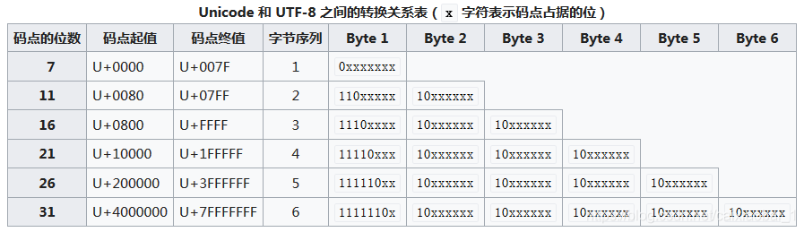

# 字符集和字符编码

## 1.基础知识

### 1.1.字符集

字符（Character）是各种文字和符号的总称，包括各国家文字、标点符号、图形符号、数字等。 
字符集（Character set）是多个字符的集合，字符集种类较多，每个字符集包含的字符个数不同，常见字符集有：ASCII字符集、GB2312字符集、BIG5字符集、 GB18030字符集、Unicode字符集等。
那么为什么会有那么多字符集标准呢？这是因为，很多规范和标准在最初制定时并没有意识到这将会是以后全球普适的准则，或者出于组织本身利益考虑想从本质上区别于现有标准。于是，就产生了那么多具有相同效果但又互不兼容的标准。

### 1.2.字符编码

字符编码（Character encoding），是把字符集中的字符，编码为指定集合中某一对象，以便在计算机中存储和通过网络的传递。
一般而言，会直接将字符在字符集中的位置，或者说是码点（code point），作为编码后的值。故而，“字符集”和“字符编码”二者是紧密耦合的。因此，某种字符集也可以说成是某种字符编码方式，例如，当我们说到“ASCII”时，既可以指代ASCII字符集，也可以指代ASCII编码。

## 2.常用字符集&字符编码

### 2.1.ASCII

ASCII（American Standard Code for Information Interchange，美国信息互换标准编码）是基于基础拉丁字符的一套编码系统。它主要用于显示现代英语。
ASCII用7bit来编码字符，共128个码位，由于计算机1个字节是8bit，所以最高位为0，即00000000-01111111（0x00-0x7F）。其中有95（十进制32-126）个可打印字符，包括常用的字母、数字、标点符号等，另外还有33（十进制0-31及127）个控制字符。ASCII字符编码对应规则如下：

```code
    Oct   Dec   Hex   Char                        Oct   Dec   Hex   Char
    ────────────────────────────────────────────────────────────────────────
    000   0     00    NUL '\0'                    100   64    40    @
    001   1     01    SOH (start of heading)      101   65    41    A
    002   2     02    STX (start of text)         102   66    42    B
    003   3     03    ETX (end of text)           103   67    43    C
    004   4     04    EOT (end of transmission)   104   68    44    D
    005   5     05    ENQ (enquiry)               105   69    45    E
    006   6     06    ACK (acknowledge)           106   70    46    F
    007   7     07    BEL '\a' (bell)             107   71    47    G
    010   8     08    BS  '\b' (backspace)        110   72    48    H
    011   9     09    HT  '\t' (horizontal tab)   111   73    49    I
    012   10    0A    LF  '\n' (new line)         112   74    4A    J
    013   11    0B    VT  '\v' (vertical tab)     113   75    4B    K
    014   12    0C    FF  '\f' (form feed)        114   76    4C    L
    015   13    0D    CR  '\r' (carriage ret)     115   77    4D    M
    016   14    0E    SO  (shift out)             116   78    4E    N
    017   15    0F    SI  (shift in)              117   79    4F    O
    020   16    10    DLE (data link escape)      120   80    50    P
    021   17    11    DC1 (device control 1)      121   81    51    Q
    022   18    12    DC2 (device control 2)      122   82    52    R
    023   19    13    DC3 (device control 3)      123   83    53    S
    024   20    14    DC4 (device control 4)      124   84    54    T
    025   21    15    NAK (negative ack.)         125   85    55    U
    026   22    16    SYN (synchronous idle)      126   86    56    V
    027   23    17    ETB (end of trans. blk)     127   87    57    W
    030   24    18    CAN (cancel)                130   88    58    X
    031   25    19    EM  (end of medium)         131   89    59    Y
    032   26    1A    SUB (substitute)            132   90    5A    Z
    033   27    1B    ESC (escape)                133   91    5B    [
    034   28    1C    FS  (file separator)        134   92    5C    \  '\\'
    035   29    1D    GS  (group separator)       135   93    5D    ]
    036   30    1E    RS  (record separator)      136   94    5E    ^
    037   31    1F    US  (unit separator)        137   95    5F    _
    040   32    20    SPACE                       140   96    60    `
    041   33    21    !                           141   97    61    a
    042   34    22    "                           142   98    62    b
    043   35    23    #                           143   99    63    c
    044   36    24    $                           144   100   64    d
    045   37    25    %                           145   101   65    e
    046   38    26    &                           146   102   66    f
    047   39    27    ′                           147   103   67    g
    050   40    28    (                           150   104   68    h
    051   41    29    )                           151   105   69    i
    052   42    2A    *                           152   106   6A    j
    053   43    2B    +                           153   107   6B    k
    054   44    2C    ,                           154   108   6C    l
    055   45    2D    -                           155   109   6D    m
    056   46    2E    .                           156   110   6E    n
    057   47    2F    /                           157   111   6F    o
    060   48    30    0                           160   112   70    p
    061   49    31    1                           161   113   71    q
    062   50    32    2                           162   114   72    r
    063   51    33    3                           163   115   73    s
    064   52    34    4                           164   116   74    t
    065   53    35    5                           165   117   75    u
    066   54    36    6                           166   118   76    v
    067   55    37    7                           167   119   77    w
    070   56    38    8                           170   120   78    x
    071   57    39    9                           171   121   79    y
    072   58    3A    :                           172   122   7A    z
    073   59    3B    ;                           173   123   7B    {
    074   60    3C    <                           174   124   7C    |
    075   61    3D    =                           175   125   7D    }
    076   62    3E    >                           176   126   7E    ~
    077   63    3F    ?                           177   127   7F    DEL
```

ASCII是美国人设计的，只能支持基础拉丁字符，但是欧洲不只是用基础拉丁字符的国家该怎么办呢？最简单的办法就是将ASCII没有用到的第8位也用上，这样能表达的字符个数就达到了256个，相较原来，增长了一倍， 这就是EASCII（Extended ASCII）。EASCII基本解决了整个西欧的字符编码问题。但是对于欧洲其它地方如北欧，东欧地区，256个字符还是不够用，因此出现了ISO 8859。为解决256个字符不够用的问题，ISO 8859采取的不再是单个独立的编码规则，而是由一系列的字符集（共15个）所组成，分别称为ISO 8859-n(n=1,2,3…11,13…16，没有12)。其每个字符集对应不同的语言，如ISO 8859-1对应西欧语言，ISO 8859-2对应中欧语言等。EASCII字符编码对应规则如下：（含表格符号、计算符号、希腊字母和特殊的拉丁符号等）

各种ISO 8859字符集：

* ISO/IEC 8859-1 (Latin-1) - 西欧语言
* ISO/IEC 8859-2 (Latin-2) - 中欧语言
* ISO/IEC 8859-3 (Latin-3) - 南欧语言。世界语也可用此字符集显示。
* ISO/IEC 8859-4 (Latin-4) - 北欧语言
* ISO/IEC 8859-5 (Cyrillic) - 斯拉夫语言
* ISO/IEC 8859-6 (Arabic) - 阿拉伯语
* ISO/IEC 8859-7 (Greek) - 希腊语
* ISO/IEC 8859-8 (Hebrew) - 希伯来语（视觉顺序）
    * ISO 8859-8-I - 希伯来语（逻辑顺序）
* ISO/IEC 8859-9（Latin-5 或 Turkish）- 它把Latin-1的冰岛语字母换走，加入土耳其语字母。
* ISO/IEC 8859-10（Latin-6 或 Nordic）- 北日耳曼语支，用来代替Latin-4。
* ISO/IEC 8859-11 (Thai) - 泰语，从泰国的 TIS620 标准字集演化而来。
* ISO/IEC 8859-13（Latin-7 或 Baltic Rim）- 波罗的语族
* ISO/IEC 8859-14（Latin-8 或 Celtic）- 凯尔特语族
* ISO/IEC 8859-15 (Latin-9) - 西欧语言，加入Latin-1欠缺的芬兰语字母和大写法语重音字母，以及欧元（€）符号。
* ISO/IEC 8859-16 (Latin-10) - 东南欧语言。主要供罗马尼亚语使用，并加入欧元符号。

ISO/IEC 8859十五个字符集的比较：

```code
Bin	Oct	Dec	Hex	1	2	3	4	5	6	7	8	9	10	11	13	14	15	16
10100000	240	160	A0	NBSP
10100001	241	161	A1	¡	Ą	Ħ	Ą	Ё		‘		¡	Ą	ก	”	Ḃ	¡	Ą
10100010	242	162	A2	¢	˘	˘	ĸ	Ђ		’	¢	¢	Ē	ข	¢	ḃ	¢	ą
10100011	243	163	A3	£	Ł	£	Ŗ	Ѓ		£	£	£	Ģ	ฃ	£	£	£	Ł
10100100	244	164	A4	¤	¤	¤	¤	Є	¤	€	¤	¤	Ī	ค	¤	Ċ	€	€
10100101	245	165	A5	¥	Ľ		Ĩ	Ѕ		₯	¥	¥	Ĩ	ฅ	„	ċ	¥	„
10100110	246	166	A6	¦	Ś	Ĥ	Ļ	І		¦	¦	¦	Ķ	ฆ	¦	Ḋ	Š	Š
10100111	247	167	A7	§	§	§	§	Ї		§	§	§	§	ง	§	§	§	§
10101000	250	168	A8	¨	¨	¨	¨	Ј		¨	¨	¨	Ļ	จ	Ø	Ẁ	š	š
10101001	251	169	A9	©	Š	İ	Š	Љ		©	©	©	Đ	ฉ	©	©	©	©
10101010	252	170	AA	ª	Ş	Ş	Ē	Њ		ͺ	×	ª	Š	ช	Ŗ	Ẃ	ª	Ș
10101011	253	171	AB	«	Ť	Ğ	Ģ	Ћ		«	«	«	Ŧ	ซ	«	ḋ	«	«
10101100	254	172	AC	¬	Ź	Ĵ	Ŧ	Ќ	،	¬	¬	¬	Ž	ฌ	¬	Ỳ	¬	Ź
10101101	255	173	AD	­	­	­	­	­	­	­	­	­	­	ญ	­	­	­	­
10101110	256	174	AE	®	Ž		Ž	Ў			®	®	Ū	ฎ	®	®	®	ź
10101111	257	175	AF	¯	Ż	Ż	¯	Џ		―	¯	¯	Ŋ	ฏ	Æ	Ÿ	¯	Ż
10110000	260	176	B0	°	°	°	°	А		°	°	°	°	ฐ	°	Ḟ	°	°
10110001	261	177	B1	±	ą	ħ	ą	Б		±	±	±	ą	ฑ	±	ḟ	±	±
10110010	262	178	B2	²	˛	²	˛	В		²	²	²	ē	ฒ	²	Ġ	²	Č
10110011	263	179	B3	³	ł	³	ŗ	Г		³	³	³	ģ	ณ	³	ġ	³	ł
10110100	264	180	B4	´	´	´	´	Д		΄	´	´	ī	ด	“	Ṁ	Ž	Ž
10110101	265	181	B5	µ	ľ	µ	ĩ	Е		΅	µ	µ	ĩ	ต	µ	ṁ	µ	”
10110110	266	182	B6	¶	ś	ĥ	ļ	Ж		Ά	¶	¶	ķ	ถ	¶	¶	¶	¶
10110111	267	183	B7	·	ˇ	·	ˇ	З		·	·	·	·	ท	·	Ṗ	·	·
10111000	270	184	B8	¸	¸	¸	¸	И		Έ	¸	¸	ļ	ธ	ø	ẁ	ž	ž
10111001	271	185	B9	¹	š	ı	š	Й		Ή	¹	¹	đ	น	¹	ṗ	¹	č
10111010	272	186	BA	º	ş	ş	ē	К		Ί	÷	º	š	บ	ŗ	ẃ	º	ș
10111011	273	187	BB	»	ť	ğ	ģ	Л	؛	»	»	»	ŧ	ป	»	Ṡ	»	»
10111100	274	188	BC	¼	ź	ĵ	ŧ	М		Ό	¼	¼	ž	ผ	¼	ỳ	Œ	Œ
10111101	275	189	BD	½	˝	½	Ŋ	Н		½	½	½	―	ฝ	½	Ẅ	œ	œ
10111110	276	190	BE	¾	ž		ž	О		Ύ	¾	¾	ū	พ	¾	ẅ	Ÿ	Ÿ
10111111	277	191	BF	¿	ż	ż	ŋ	П	؟	Ώ		¿	ŋ	ฟ	æ	ṡ	¿	ż
11000000	300	192	C0	À	Ŕ	À	Ā	Р		ΐ		À	Ā	ภ	Ą	À	À	À
11000001	301	193	C1	Á	Á	Á	Á	С	ء	Α		Á	Á	ม	Į	Á	Á	Á
11000010	302	194	C2	Â	Â	Â	Â	Т	آ	Β		Â	Â	ย	Ā	Â	Â	Â
11000011	303	195	C3	Ã	Ă		Ã	У	أ	Γ		Ã	Ã	ร	Ć	Ã	Ã	Ă
11000100	304	196	C4	Ä	Ä	Ä	Ä	Ф	ؤ	Δ		Ä	Ä	ฤ	Ä	Ä	Ä	Ä
11000101	305	197	C5	Å	Ĺ	Ċ	Å	Х	إ	Ε		Å	Å	ล	Å	Å	Å	Ć
11000110	306	198	C6	Æ	Ć	Ĉ	Æ	Ц	ئ	Ζ		Æ	Æ	ฦ	Ę	Æ	Æ	Æ
11000111	307	199	C7	Ç	Ç	Ç	Į	Ч	ا	Η		Ç	Į	ว	Ē	Ç	Ç	Ç
11001000	310	200	C8	È	Č	È	Č	Ш	ب	Θ		È	Č	ศ	Č	È	È	È
11001001	311	201	C9	É	É	É	É	Щ	ة	Ι		É	É	ษ	É	É	É	É
11001010	312	202	CA	Ê	Ę	Ê	Ę	Ъ	ت	Κ		Ê	Ę	ส	Ź	Ê	Ê	Ê
11001011	313	203	CB	Ë	Ë	Ë	Ë	Ы	ث	Λ		Ë	Ë	ห	Ė	Ë	Ë	Ë
11001100	314	204	CC	Ì	Ě	Ì	Ė	Ь	ج	Μ		Ì	Ė	ฬ	Ģ	Ì	Ì	Ì
11001101	315	205	CD	Í	Í	Í	Í	Э	ح	Ν		Í	Í	อ	Ķ	Í	Í	Í
11001110	316	206	CE	Î	Î	Î	Î	Ю	خ	Ξ		Î	Î	ฮ	Ī	Î	Î	Î
11001111	317	207	CF	Ï	Ď	Ï	Ī	Я	د	Ο		Ï	Ï	ฯ	Ļ	Ï	Ï	Ï
11010000	320	208	D0	Ð	Đ		Đ	а	ذ	Π		Ğ	Ð	ะ	Š	Ŵ	Ð	Đ
11010001	321	209	D1	Ñ	Ń	Ñ	Ņ	б	ر	Ρ		Ñ	Ņ	ั	Ń	Ñ	Ñ	Ń
11010010	322	210	D2	Ò	Ň	Ò	Ō	в	ز			Ò	Ō	า	Ņ	Ò	Ò	Ò
11010011	323	211	D3	Ó	Ó	Ó	Ķ	г	س	Σ		Ó	Ó	ำ	Ó	Ó	Ó	Ó
11010100	324	212	D4	Ô	Ô	Ô	Ô	д	ش	Τ		Ô	Ô	ิ	Ō	Ô	Ô	Ô
11010101	325	213	D5	Õ	Ő	Ġ	Õ	е	ص	Υ		Õ	Õ	ี	Õ	Õ	Õ	Ő
11010110	326	214	D6	Ö	Ö	Ö	Ö	ж	ض	Φ		Ö	Ö	ึ	Ö	Ö	Ö	Ö
11010111	327	215	D7	×	×	×	×	з	ط	Χ		×	Ũ	ื	×	Ṫ	×	Ś
11011000	330	216	D8	Ø	Ř	Ĝ	Ø	и	ظ	Ψ		Ø	Ø	ุ	Ų	Ø	Ø	Ű
11011001	331	217	D9	Ù	Ů	Ù	Ų	й	ع	Ω		Ù	Ų	ู	Ł	Ù	Ù	Ù
11011010	332	218	DA	Ú	Ú	Ú	Ú	к	غ	Ϊ		Ú	Ú	ฺ	Ś	Ú	Ú	Ú
11011011	333	219	DB	Û	Ű	Û	Û	л		Ϋ		Û	Û		Ū	Û	Û	Û
11011100	334	220	DC	Ü	Ü	Ü	Ü	м		ά		Ü	Ü		Ü	Ü	Ü	Ü
11011101	335	221	DD	Ý	Ý	Ŭ	Ũ	н		έ		İ	Ý		Ż	Ý	Ý	Ę
11011110	336	222	DE	Þ	Ţ	Ŝ	Ū	о		ή		Ş	Þ		Ž	Ŷ	Þ	Ț
11011111	337	223	DF	ß	ß	ß	ß	п		ί	‗	ß	ß	฿	ß	ß	ß	ß
11100000	340	224	E0	à	ŕ	à	ā	р	ـ	ΰ	א	à	ā	เ	ą	à	à	à
11100001	341	225	E1	á	á	á	á	с	ف	α	ב	á	á	แ	į	á	á	á
11100010	342	226	E2	â	â	â	â	т	ق	β	ג	â	â	โ	ā	â	â	â
11100011	343	227	E3	ã	ă		ã	у	ك	γ	ד	ã	ã	ใ	ć	ã	ã	ă
11100100	344	228	E4	ä	ä	ä	ä	ф	ل	δ	ה	ä	ä	ไ	ä	ä	ä	ä
11100101	345	229	E5	å	ĺ	ċ	å	х	م	ε	ו	å	å	ๅ	å	å	å	ć
11100110	346	230	E6	æ	ć	ĉ	æ	ц	ن	ζ	ז	æ	æ	ๆ	ę	æ	æ	æ
11100111	347	231	E7	ç	ç	ç	į	ч	ه	η	ח	ç	į	็	ē	ç	ç	ç
11101000	350	232	E8	è	č	è	č	ш	و	θ	ט	è	č	่	č	è	è	è
11101001	351	233	E9	é	é	é	é	щ	ى	ι	י	é	é	้	é	é	é	é
11101010	352	234	EA	ê	ę	ê	ę	ъ	ي	κ	ך	ê	ę	๊	ź	ê	ê	ê
11101011	353	235	EB	ë	ë	ë	ë	ы	ً	λ	כ	ë	ë	๋	ė	ë	ë	ë
11101100	354	236	EC	ì	ě	ì	ė	ь	ٌ	μ	ל	ì	ė	์	ģ	ì	ì	ì
11101101	355	237	ED	í	í	í	í	э	ٍ	ν	ם	í	í	ํ	ķ	í	í	í
11101110	356	238	EE	î	î	î	î	ю	َ	ξ	מ	î	î	๎	ī	î	î	î
11101111	357	239	EF	ï	ď	ï	ī	я	ُ	ο	ן	ï	ï	๏	ļ	ï	ï	ï
11110000	360	240	F0	ð	đ		đ	№	ِ	π	נ	ğ	ð	๐	š	ŵ	ð	đ
11110001	361	241	F1	ñ	ń	ñ	ņ	ё	ّ	ρ	ס	ñ	ņ	๑	ń	ñ	ñ	ń
11110010	362	242	F2	ò	ň	ò	ō	ђ	ْ	ς	ע	ò	ō	๒	ņ	ò	ò	ò
11110011	363	243	F3	ó	ó	ó	ķ	ѓ		σ	ף	ó	ó	๓	ó	ó	ó	ó
11110100	364	244	F4	ô	ô	ô	ô	є		τ	פ	ô	ô	๔	ō	ô	ô	ô
11110101	365	245	F5	õ	ő	ġ	õ	ѕ		υ	ץ	õ	õ	๕	õ	õ	õ	ő
11110110	366	246	F6	ö	ö	ö	ö	і		φ	צ	ö	ö	๖	ö	ö	ö	ö
11110111	367	247	F7	÷	÷	÷	÷	ї		χ	ק	÷	ũ	๗	÷	ṫ	÷	ś
11111000	370	248	F8	ø	ř	ĝ	ø	ј		ψ	ר	ø	ø	๘	ų	ø	ø	ű
11111001	371	249	F9	ù	ů	ù	ų	љ		ω	ש	ù	ų	๙	ł	ù	ù	ù
11111010	372	250	FA	ú	ú	ú	ú	њ		ϊ	ת	ú	ú	๚	ś	ú	ú	ú
11111011	373	251	FB	û	ű	û	û	ћ		ϋ		û	û	๛	ū	û	û	û
11111100	374	252	FC	ü	ü	ü	ü	ќ		ό		ü	ü		ü	ü	ü	ü
11111101	375	253	FD	ý	ý	ŭ	ũ	§		ύ	LRM	ı	ý		ż	ý	ý	ę
11111110	376	254	FE	þ	ţ	ŝ	ū	ў		ώ	RLM	ş	þ		ž	ŷ	þ	ț
11111111	377	255	FF	ÿ	·	·	·	џ				ÿ	ĸ		’	ÿ	ÿ	ÿ
```

### 2.2.中文编码

为了扩充ASCII，以用于显示本国的语言，不同的国家和地区制定了不同的标准，由此产生了GB2312（简体中文），BIG5（繁体中文），JIS（日文）等各自的编码标准。

#### 2.2.1.GB2312

为了满足国内在计算机中使用汉字的需要，中国国家标准总局发布了一系列的汉字字符集国家标准编码，统称为GB码，或国标码。其中最有影响的是于1980年发布的《信息交换用汉字编码字符集·基本集》，标准号为GB 2312-1980。GB2312通行于我国内地，新加坡等地也采用此编码标准，并且几乎所有的中文系统和国际化的软件都支持GB2312。
GB2312是一个简体中文字符集，收录简化汉字及一般符号、序号、数字、拉丁字母、日文假名、希腊字母、俄文字母、汉语拼音符号、汉语注音字母，共 7445 个图形字符。其中包括6763个汉字，含一级汉字3755个，二级汉字3008个；包括拉丁字母、希腊字母、日文平假名及片假名字母、俄语西里尔字母在内的682个全角字符。GB2312对所收录字符进行了“分区”处理，共94个区，区从1（十进制）开始，一直到94（十进制），每区含有94个位，位从1（十进制）开始，一直到94（十进制），共8836（94 * 94）个码位。由此，每个字符都能找到其唯一对应的区位和码位，这种表示方式也称为区位码。各区具体说明如下：

序号 | 说明
----|-------------------------------
1   | 01-09区收录除汉字外的682个字符，有164个空位（9 * 94 - 682）
2   | 10-15区为空白区，没有使用
3   | 16-55区收录3755个一级汉字（简体），按拼音排序
4   | 56-87区收录3008个二级汉字（简体），按部首/笔画排序
5   | 88-94区为空白区，没有使用

GB2312以区位码为基础，对字符采用双字节编码，其中高字节表示区码，低字节表示位码。由于区码和位码的取值范围均在1－94之间，此范围同ASCII的编码范围冲突。例如汉字‘珀’在GB2312中的区位码为7174（十进制），其双字节表示形式为71、74；而两个ASCII字符‘GJ’的存储码也是71、74，这种冲突将导致解码时的混乱。为解决这个问题，GB2312将区位码均加上0xA0，这样高低字节的第8位都变成了1，进而同ASCII区分开来。具体操作如下图：


例如，‘李’字的区位码为3278（表示在32区，78位），按照上图步骤获取其GB2312编码：

1. 将32（区）转化为十六进制为20；

2. 加上A0为C0；

3. 将78（位）转化为十六进制为4E；

4. 加上A0为EE；

5. 组合区和位，为C0EE；

6. 得到‘李’字的GB2312编码为C0EE。

字符 | GBK编码10进制 | GBK编码16进制(GBK内码) | Unicode编码10进制 | Unicode编码16进制
----|---------------|-----------------------|------------------|------------------
李  | 49390         | C0EE                  | 26446            | 674E

所以说，GB2312是兼容ASCII的一种编码方式：一个小于127的字符的意义与原来相同，但两个大于127的字符连在一起时，就表示一个汉字，前面的一个字节（高字节）范围从0xA1到0xF7，后面一个字节（低字节）范围从0xA1到0xFE，这样我们就可以组合出7000多个简体汉字了。在这些编码里，还把数学符号、罗马希腊的 字母、日文的假名们都编进去了，连在ASCII里本来就有的数字、标点、字母都统统重新编了两个字节长的编码，这就是常说的“全角”字符，而原来在127以下的那些就叫“半角”字符了。 
有人可能曾困惑过：GB2312采用双字节编码，原则上来说共有65536个码位，为何实际却只收录字符7445个？现在，我想答案应该是显而易见的：出于兼容ASCII和节省存储容量的考虑，GB2112的双字节编码是变长的，有些字符是单字节表示，如ASCII字符，有些字符是双字节表示，如汉字，由此而来的代价就是损失一部分码位；而且，编码的设计也并非想象的那样，所有字符从头到尾布满整个二维表，其中还预留有一部分空间以作他用。
GB2312的出现，基本满足了汉字的计算机处理需要，它所收录的汉字已经覆盖中国大陆99.75%的使用频率。然而，对于人名、古汉语等方面出现的罕用字，GB2312却不能处理，这就导致了后来GBK及GB18030的出现。

#### 2.2.2.BIG5

在台湾、香港与澳门地区，使用的是繁体中文字符集。而1980年发布的GB2312面向简体中文字符集，并不支持繁体汉字。在这些使用繁体中文字符集的地区，一度出现过很多不同厂商提出的字符集编码，这些编码彼此互不兼容，造成了信息交流的困难。为统一繁体字符集编码，1984年，台湾五大厂商宏碁、神通、佳佳、零壹以及大众一同制定了一种繁体中文编码方案，即Big5，又称大五码。 
大五码是一种繁体中文汉字字符集，其中繁体汉字13053个，808个标点符号、希腊字母及特殊符号。大五码采用双字节编码，第1字节范围0x81－0xFE，避开了同ASCII码的冲突，第2字节范围是0x40－0x7E和0xA1－0xFE。因为Big5的字符编码范围同GB2312存在冲突，所以二者并不兼容。Big5字符编码分布表如下：

编码范围（十六进制）| 符号类别
------------------|---------------------
8140－A0FE        | 保留（用作造字区）
A140－A3BF        | 标点符号、希腊字母及特殊符号
A3C0－A3FE        | 保留（未开放用于造字区）
A440－C67E        | 常用汉字（先按笔划，再按部首排序）
C6A1－C8FE        | 保留（用作造字区）
C940－F9D5        | 非常用汉字（先按笔划，再按部首排序）
F9D6－FEFE        | 保留（用作造字区）

Big5编码推出后，得到了繁体中文软件厂商的广泛支持，在使用繁体汉字的地区迅速普及使用。目前，Big5编码在台湾、香港、澳门及其他海外华人中普遍使用，成为了繁体中文编码的事实标准。在互联网中检索繁体中文网站，所打开的网页中，大多都是通过Big5编码产生的文档。 
不过，尽管Big5码内包含一万多个字符，但是没有考虑社会上流通的人名、地名用字、方言用字、化学及生物科等用字，也没有包含日文平假名及片假名字母。

#### 2.2.3.GBK

GBK即汉字内码扩展规范，K为扩展的汉语拼音中“扩”字的声母。英文全称Chinese Internal Code Specification。GBK编码标准兼容GB2312，是对GB2312-80的扩展，简、繁体字融于一库。GBK采用双字节表示，总体编码范围为8140-FEFE，首字节在81-FE 之间，尾字节在40-FE 之间。总计23940 个码位，共收入21886个字符，其中汉字（包括部首和构件）21003 个，图形符号883 个。GBK同样兼容ASCII，00–7F范围内单字节表示ASCII字符。

#### 2.2.4.GB18030

GB18030，全称GB18030-2000《信息交换用汉字编码字符集基本集的扩充》，是我国政府于2000年3月17日发布的新的汉字编码国家标准，2001年8月31日后在中国市场上发布的软件必须符合本标准。 
GB18030字符集标准解决了汉字、日文假名、朝鲜语和中国少数民族文字组成的大字符集计算机编码问题。该标准的字符总编码空间超过150万个编码位，收录了27484个汉字，覆盖中文、日文、朝鲜语和中国少数民族文字。满足中国大陆、香港、台湾、日本和韩国等东亚地区信息交换多文种、大字量、多用途、统一编码格式的要求。 
GB18030标准采用单字节、双字节和四字节三种方式对字符编码，兼容ASCII、GB2312和GBK。

#### 2.2.5.小结

——      | GB2312        | BIG5          | GBK           | GB18030
--------|---------------|---------------|---------------|--------- 
字符集  | 简体中文       | 繁体中文       | GB2312的扩展，加入对繁体字的支持 | 中日韩文字和少数民族文字
字节数  | 1字节，兼容ASCII；2字节 | 1字节，兼容ASCII；2字节 | 1字节，兼容ASCII；2字节 | 1字节，兼容ASCII；2字节；4字节
兼容性  | 兼容ASCII      | 兼容 ASCII    | 兼容ASCII、GB2312 | 兼容ASCII、GB2312、GBK

## 3.Unicode（Universal Multiple-Octet Coded Character Set）

### 3.1.Unicode字符集

为什么有Unicode：虽然通过使用不同字符集，我们可以在一台机器上查阅不同语言的文档，但是我们仍然无法解决一个问题：在一份文档中显示世界上所有字符。为了解决这个问题，需要一个全人类达成共识的巨大的字符集，这就是Unicode字符集。 

Unicode（中文：万国码、国际码、统一码、单一码）是计算机科学领域里的一项业界标准。它对世界上大部分的文字系统进行了整理、编码，使得电脑可以用更为简单的方式来呈现和处理文字。 

Unicode字符集包含了可能出现的所有字符，每个字符对应一个数字，这个数字即码点（Code Point），如字符‘H’的码点为72，字符‘李’的码点为26446。Unicode包含了1114112个码点，即0x000000-0x10FFFF。世界上所有字符都可以在Unicode字符集中找到对应的唯一码点。 

Unicode按照使用上的频繁度将码空间划分为17个平面，00-10（十六进制，最高两位），即从0 - 16（十进制），每个平面有65536个码点（2^16），其中最重要的是第一个Unicode平面（码位0x0000-0xFFFF），包含了最常用的字符，该平面被称为基本多语言平面（Basic Multilingual Plane），缩写为BMP，其他平面称为辅助平面（Supplementary Planes），要么是用来表示一些远古时期的文字，要么是留作扩展。Unicode字符集中各个平面的基本情况如下：


Wiki百科：[Unicode字符平面映射](https://zh.wikipedia.org/wiki/Unicode%E5%AD%97%E7%AC%A6%E5%B9%B3%E9%9D%A2%E6%98%A0%E5%B0%84)

在BMP里的所有字符，要用4位十六进制数（例如U+4AE0，共支持六万多个字符）；在BMP以外的字符则需要使用5位或6位十六进制数了。 

Unicode只是一个字符集，只规定了字符所对应的码点，并没有指定字符编码方式，也即从码点到用来存储的比特流之间如何映射。关于这一点，我们不妨回忆一下之前曾经讲过的：一般而言，会直接将字符在字符集中的位置，或者说是码点，作为编码后的值。在这种方式下，字符集和字符编码耦合紧密，限制了字符集的扩展能力。鉴于此，Unicode将字符集和字符编码方案分离开，从字符到码点，再从码点到编码值，作了两次映射。这样，虽然每个字符在Unicode字符集中都能找到唯一确定的码点，但是最终的编码值却是由具体的编码方案决定。例如，同样是对字符“A”进行编码，UTF-8编码得到的值是0x41，而UTF-16（Big-Endian）得到的却是0x0041。

### 3.2.编码方案

Unicode的编码方案又叫Unicode转换格式，简称为UTF（Unicode Transformation Format），包括UTF-16、UTF-32以及UTF-8，其中又属UTF-8使用最为广泛。

#### 3.2.1.UTF-16

UTF-16对应于UCS-2，采用双字节编码BMP内位于U+0000至U+D7FF以及U+E000至U+FFFF字符，编码后的值等同于对应的码点；由于BMP内的U+D800至U+DFFF码位不对应于任何字符，UTF-16借助于这些码位，根据一定的规则，采用四字节编码辅助平面内位于U+10000至U+10FFFF的字符。因此，UTF-16是一种变长编码方式。 

UTF-16可看成是UCS-2的父集。在没有辅助平面字符前，UTF-16与UCS-2所指的是同一的意思。但当引入辅助平面字符后，就称为UTF-16了。现在若有软件声称自己支持UCS-2编码，那其实是暗指它不能支持在UTF-16中超过2字节的字集。对于小于0x10000的UCS码，UTF-16编码就等于UCS码。 

UTF-16编码分大端序（Big-Endian，简称UTF-16 BE）和小端序（Little-Endian，简称UTF-16 LE）两种，区别在于字节序的不同。例如，汉字“奎”的Unicode码点是594E，“乙”的Unicode码点是4E59。如果我们收到UTF-16字节流“594E”，那么这是“奎”还是“乙”？UTF-16采用BOM（Byte Order Mark，字节序标记）机制来解决这个问题：在Unicode中有两个特殊字符，一个是U+FEFF，表示”ZERO WIDTH NO-BREAK SPACE”；另一个是U+FFFE，它在Unicode中是不存在的字符，所以不应该出现在实际传输中。UTF-16在传输字节流前，先传输一个BOM，这样如果接收者收到FEFF，就表明这个字节流是Big-Endian的；如果收到FFFE，就表明这个字节流是Little-Endian的。 

以下的例子有四个字符：U+6731（朱）、U+002C（,）、U+807F（聿）、U+2A6A5（四个“龍”组成，无法显示）。

使用 UTF-16 编码的例子：


#### 3.2.3.UTF-8 

UTF-8使用一至六个字节为每个字符编码

1. 128个ASCII字符只需一个字节编码（U+0000至U+007F）。 
2. 带有附加符号的拉丁文、希腊文、西里尔字母、亚美尼亚语、希伯来文、阿拉伯文、叙利亚文及它拿字母则需要两个字节编码（U+0080至U+07FF）。 
3. 其他基本多文种平面（BMP）中的字符（这包含了大部分常用字，如大部分的汉字）使用三个字节编码（U+0800至U+FFFF）。 
4. 其他极少使用的Unicode 辅助平面的字符使用四至六字节编码（U+10000至U+1FFFFF使用四字节，U+200000至U+3FFFFFF使用五字节，U+4000000至U+7FFFFFFF使用六字节）。 

Unicode 和 UTF-8 之间的转换关系：



总结一下就是：1.对于单字节编码字符，字节的第一位设为0，后面7位为该字符的二进制Unicode码点值，故而UTF-8兼容ASCII；2.对于n字节编码字符（n>1），第一个字节的前n位都设为1，第n+1位设为0，后面字节的前两位一律设为10，剩下的二进制位，全部用该字符的二进制Unicode码点值替代。 

来看个例子。字符“汉”表示为U+6C49，6C49在0800-FFFF之间，所以要用3字节模板：1110xxxx 10xxxxxx 10xxxxxx。将6C49写成二进制是：0110 110001 001001（不足16位，前面补0）， 用这个比特流依次代替模板中的x，得到：11100110 10110001 10001001，转换为十六进制，即UTF-8编码为E6 B1 89。

UTF-8编码的优点： 

1. ASCII是UTF-8的一个子集。因为一个纯ASCII字符串也是一个合法的UTF-8字符串，所以现存的ASCII文本不需要转换。为传统的扩展ASCII字符集设计的软件通常可以不经修改或很少修改就能与UTF-8一起使用。 
2. UTF-8字符串可以由一个简单的算法可靠地识别出来。就是，一个字符串在任何其它编码中表现为合法的UTF-8的可能性很低，并随字符串长度增长而减小。举例说，字符值C0、C1、F5至FF从来没有出现。为了更好的可靠性，可以使用正则表达式来统计非法过长和替代值。 

UTF-8编码的缺点： 

1. 与其他Unicode编码相比，特别是UTF-16，在UTF-8中ASCII字符占用的空间只有一半，可是在一些字符的UTF-8编码占用的空间就要多出1/3，特别是中文、日文和韩文（CJK）这样的方块文字。

由于在UTF-8编码中，其自身已经带了控制信息，如1110xxxx 10xxxxxx 10xxxxxx，其中1110就起到了控制作用，所以不需要额外的BOM机制，但可以用BOM来表明编码方式。字符”ZERO WIDTH NO-BREAK SPACE”的UTF-8编码是0xEFBBBF，所以如果接收者收到以0xEFBBBF开头的字节流，就知道这是UTF-8编码了。但是需要注意，不是所有软件或者程序都能正确处理BOM标记，所以我们不推荐对UTF-8编码的文件加上BOM。

## 4.判断字符串是否是UTF-8编码格式

```c
int is_utf8(const char* str, size_t length)
{
    size_t i = 0;
    int nBytes = 0; // UTF8可用1-6个字节编码,ASCII用一个字节
    unsigned char ch = 0;
    bool bAllAscii = true; // 如果全部都是ASCII,说明不是UTF-8
    while(i < length)
    {
        ch = *(str + i);
         if ((ch & 0x80) != 0)
            bAllAscii = false;
        if(nBytes == 0)
        {
            if((ch & 0x80) != 0)
            {
                while((ch & 0x80) != 0)
                {
                    ch <<= 1;
                    nBytes ++;
                }
                if((nBytes < 2) || (nBytes > 6))
                {
                    return 0;
                }
                nBytes --;
            }
        }
        else
        {
            if((ch & 0xc0) != 0x80)
            {
                return 0;
            }
            nBytes --;
        }
        i ++;
    }
    if(bAllAscii)
        return false;
    return (nBytes == 0);
}
```

```c
_Bool is_utf8(const char * string)
{
    if(!string)
        return 0;

    const unsigned char * bytes = (const unsigned char *)string;
    while(*bytes)
    {
        if( (// ASCII
             // use bytes[0] <= 0x7F to allow ASCII control characters
                bytes[0] == 0x09 ||
                bytes[0] == 0x0A ||
                bytes[0] == 0x0D ||
                (0x20 <= bytes[0] && bytes[0] <= 0x7E)
            )
        ) {
            bytes += 1;
            continue;
        }

        if( (// non-overlong 2-byte
                (0xC2 <= bytes[0] && bytes[0] <= 0xDF) &&
                (0x80 <= bytes[1] && bytes[1] <= 0xBF)
            )
        ) {
            bytes += 2;
            continue;
        }

        if( (// excluding overlongs
                bytes[0] == 0xE0 &&
                (0xA0 <= bytes[1] && bytes[1] <= 0xBF) &&
                (0x80 <= bytes[2] && bytes[2] <= 0xBF)
            ) ||
            (// straight 3-byte
                ((0xE1 <= bytes[0] && bytes[0] <= 0xEC) ||
                    bytes[0] == 0xEE ||
                    bytes[0] == 0xEF) &&
                (0x80 <= bytes[1] && bytes[1] <= 0xBF) &&
                (0x80 <= bytes[2] && bytes[2] <= 0xBF)
            ) ||
            (// excluding surrogates
                bytes[0] == 0xED &&
                (0x80 <= bytes[1] && bytes[1] <= 0x9F) &&
                (0x80 <= bytes[2] && bytes[2] <= 0xBF)
            )
        ) {
            bytes += 3;
            continue;
        }

        if( (// planes 1-3
                bytes[0] == 0xF0 &&
                (0x90 <= bytes[1] && bytes[1] <= 0xBF) &&
                (0x80 <= bytes[2] && bytes[2] <= 0xBF) &&
                (0x80 <= bytes[3] && bytes[3] <= 0xBF)
            ) ||
            (// planes 4-15
                (0xF1 <= bytes[0] && bytes[0] <= 0xF3) &&
                (0x80 <= bytes[1] && bytes[1] <= 0xBF) &&
                (0x80 <= bytes[2] && bytes[2] <= 0xBF) &&
                (0x80 <= bytes[3] && bytes[3] <= 0xBF)
            ) ||
            (// plane 16
                bytes[0] == 0xF4 &&
                (0x80 <= bytes[1] && bytes[1] <= 0x8F) &&
                (0x80 <= bytes[2] && bytes[2] <= 0xBF) &&
                (0x80 <= bytes[3] && bytes[3] <= 0xBF)
            )
        ) {
            bytes += 4;
            continue;
        }
        return 0;
    }
    return 1;
}
```

本文转自CSDN博主「一壶青梅酒」的原创文章，原文地址：[https://blog.csdn.net/caixiaobai_1/article/details/103876783](https://blog.csdn.net/caixiaobai_1/article/details/103876783)